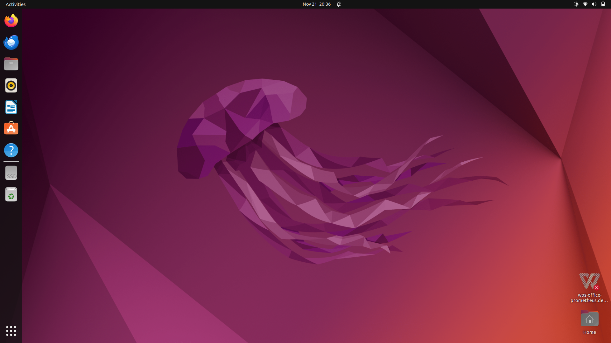

# 

# Bab 2   Berkenalan dengan Ubuntu 22.04 LTS

## Tujuan
Setelah menyelesaikan bab ini pembaca diharapkan dapat:
- Memahami antarmuka pengguna dan fitur-fitur umum Ubuntu.

Ubuntu 22.04 menggunakan lingkungan desktop GNOME versi 42 yang menawarkan antarmuka modern dan intuitif. Saat pengguna pertama kali masuk ke sistem mereka akan disambut oleh tampilan desktop yang bersih dengan panel atas yang menampilkan jam, pengaturan sistem, dan indikator status, serta dock di sisi kiri layar yang berisi pintasan ke aplikasi-aplikasi utama.

 

   

