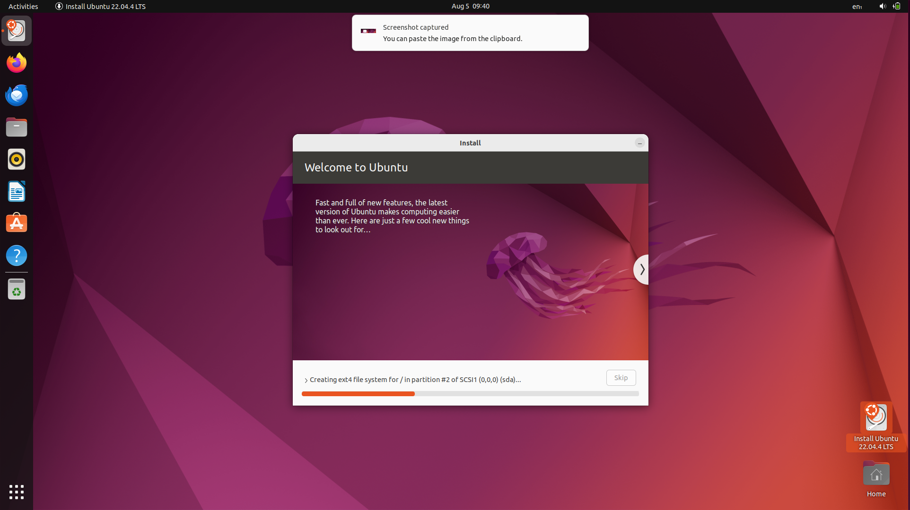

# Instalasi Sistem Operasi Ubuntu
## Tujuan
Setelah menyelesaikan bab ini pembaca diharapkan dapat:
- Memahami langkah-langkah dasar dalam instalasi sistem operasi Ubuntu.
- Menyiapkan lingkungan yang sesuai untuk instalasi Ubuntu pada perangkat keras.
- Melakukan instalasi sistem operasi Ubuntu pada PC/Laptop.

Ubuntu adalah salah satu distribusi Linux yang populer, digunakan secara luas karena kemudahan penggunaannya dan dukungan komunitas yang besar. Pada bab ini anda akan mempelajari bagaimana mengunduh, menyiapkan, dan instalasi Ubuntu pada PC/Laptop.

## Persiapan Instalasi
Sebelum melakukan instalasi, ada beberapa hal yang perlu disiapkan :
- **Spesifikasi Minimum:**
  - Prosesor : Dual-core 2 GHz
  - RAM : 4 GB (direkomendasikan 8 GB)
  - Penyimpanan : 25 GB ruang kosong
  - USB flash drive (minimal 8 GB)
  - Koneksi internet (opsional)

- **Mengunduh ISO Ubuntu:**
  1. Buka situs resmi Ubuntu di [http://ubuntu.com](http://ubuntu.com).
  2. Pilih Ubuntu desktop, misalnya Ubuntu Desktop 22.04 LTS.
  3. Klik link yang tersedia untuk mendapatkan file ISO.

  
    

  

  
 

- **Membuat Bootable USB**  
  #### Alat yang diperlukan untuk membuat bootable USB
  - Perangkat Lunak 
    - Etcher (tersedia untuk Windows, MacOS dan Linux), dapat didownload pada link berikut [etcher.balena.io](https://etcher.balena.io/)
  - Perangkat Keras
    - USB Flashdrive minimal 8 GB.

  #### Langkah-Langkah Membuat Bootable USB
  1. Sambungkan USB flash drive minimal 8 GB ke komputer.
  2. Buka aplikasi Etcher yang sudah diunduh dan diinstal.
  3. Pada tampilan utama Etcher, klik Select Image dan pilih file ISO Ubuntu yang telah diunduh.
  4. Klik Select Target dan pilih USB yang akan digunakan sebagai media instalasi.
  5. Klik Flash! untuk memulai proses pembuatan bootable USB.
       
 

       

       

    
  6. Tunggu hingga proses selesai, dan lepaskan USB setelah flash selesai.

## Langkah-Langkah Instalasi Sistem Operasi Ubuntu

1. **Booting dari USB** 
   - Sambungkan USB bootable ke Laptop/PC.
   - Restart komputer dan masuk ke BIOS/UEFI dengan menekan tombol seperti F2, F12, atau Del. Tombol akses BIOS/UEFI dapat dilihat pada tabel berikut :  
  
     | Merk Laptop/PC | Tombol Akses |
     | :----: | -----|
     | Acer   | F1, F2, atau CTRL+ALT+ESC   |
     | ASUS   | f2   |
     | Axioo   | f2   |
     | Dell   | F2, Del, F12, F1, F3, atau Fn+F1   |
     | Fuijitsu   | f2   |
     | HP/Compaq   | ESC, F10, atau F1   |
     | Lenovo   | F2 atau Fn+F2   |
     | MSI   | Del   |
     | Samsung   | f2   |
     | Sony Vaio   | F1, F2, atau F3   |
     | Toshiba   | F2, ESC+F1, atau F2+power   |
     | Zyrex   | Del atau Esc   |

   - Ubah urutan booting agar USB menjadi prioritas pertama.
   - Simpan pengaturan dan keluar dari BIOS/UEFI.

2. **Memulai Instalasi** 
   - Setelah komputer melakukan booting dari USB, pilih Install Ubuntu.
     
 

     

     

   - Pilih bahasa yang akan digunakan dan klik Continue.
  
3. **Pengaturan Instalasi** 
   - Keyboard Layout: Pilih tata letak keyboard yang sesuai dan tekan Continue.
     
 

     

     

   - Updates and Other Software: Pilih apakah ingin menginstall pembaruan dan perangkat lunak pihak ketiga selama instalasi seperti codec multimedia.
     
 

     

     

   - Installation Type : 
     - Install Ubuntu alongside [OS lama] untuk dual boot.
     - Erase disk and install Ubuntu untuk menggantikan sistem operasi yang ada.
     - Something else untuk membuat kustomisasi partisi instalasi secara  manual.
     
 

     

     

     Klik Install Now untuk memulai proses instalasi.
   - Time Zone: Pilih zona waktu sesuai lokasi dan klik Continue.
     
 

     

     

4. **Konfigurasi Pengguna** 
   - Masukkan nama pengguna dan password yang diinginkan.
   - Pilih metode login, apakah otomatis atau manual kemudian klik Continue.
     
 

     

     

5. **Proses Instalasi dan Penyelesaian** 
   - Setelah semua pengaturan selesai, proses instalasi akan dimulai.
     
 

     

     

   - Tunggu hingga instalasi selesai. Setelah itu klik Restart Now.
   - Lepaskan USB ketika komputer melakukan restart.
