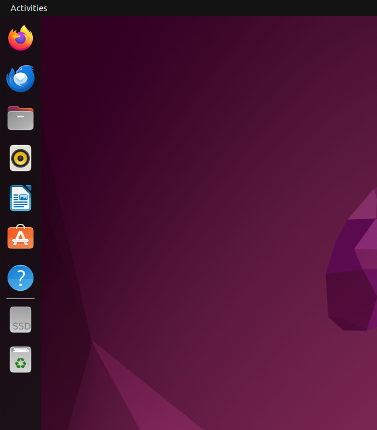

# Dock

Dock adalah panel vertikal di sisi kiri layar yang berisi ikon-ikon aplikasi favorit dan aplikasi yang sedang berjalan. Pengguna dapat menambahkan atau menghapus aplikasi dari Dock sesuai kebutuhan. Letak Dock bisa diubah ke bawah atau kanan melalui pengaturan sistem. Dock memberikan kemudahan akses terhadap aplikasi yang sering digunakan.

 

   

