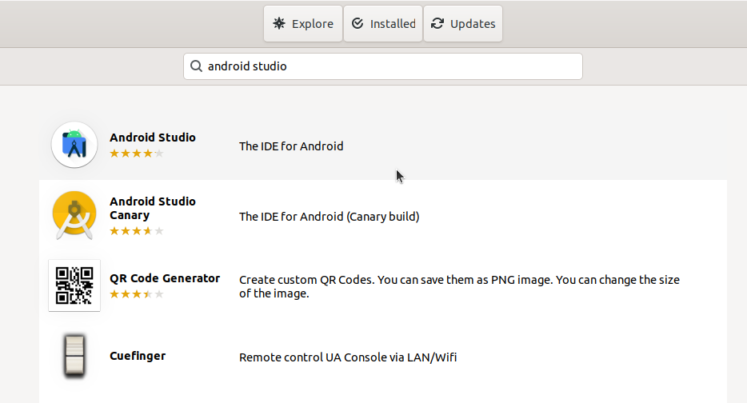
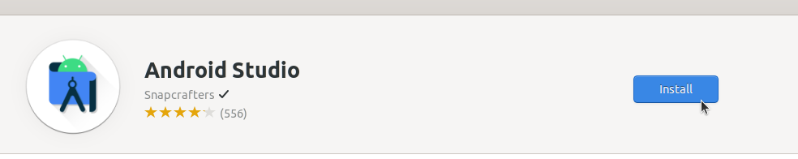
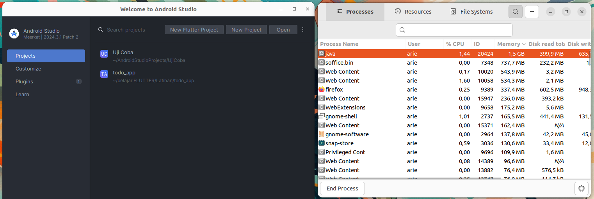

# Instalasi Android Studio
Android Studio adalah Integrated Development Environment (IDE) resmi yang dikembangkan oleh Google untuk pengembangan aplikasi Android. IDE ini berbasis pada IntelliJ IDEA dan dirancang khusus untuk membangun aplikasi Android dengan berbagai fitur canggih seperti editor kode, desain antarmuka grafis, debugger, dan emulasi Android. Android Studio mendukung bahasa pemrograman Java dan Kotlin, serta menyediakan alat bantu untuk debugging, pengujian, dan profiling aplikasi.
## Langkah-Langkah Instalasi
### 1. Buka Ubuntu Software
Untuk membuka ubuntu software dapat mengklik icon ubuntu software pada menu applications.

### 2. Cari Android Studio
Klik icon search pada pojok kiri atas ubuntu software kemudian masukkan keyword "Android Studio".

### 3. Install Android Studio
Pilih software yang sesuai kemudian tekan tombol install.

### 4. Verifikasi Instalasi
Tunggu hingga proses instalasi selesai, Android Studio yang sudah terinstall dapat ditemukan pada menu Applications.
Berikut adalah Android Studio ketika berjalan di Ubuntu 22.04 LTS.

