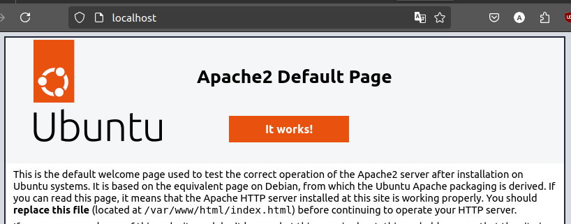

# Instalasi Apache2
Apache2 (atau Apache HTTP Server) adalah perangkat lunak server web open-source yang paling banyak digunakan di dunia. Apache2 berfungsi untuk menghosting situs web dengan mengelola permintaan HTTP dari klien dan mengirimkan respons yang sesuai, seperti halaman HTML, gambar, dan file lainnya. Apache2 juga dapat dikonfigurasi untuk bekerja dengan berbagai teknologi pemrograman seperti PHP, Python, dan Perl untuk menyediakan fungsionalitas dinamis pada situs web.
## Langkah-Langkah Instalasi
### 1. Perbarui daftar paket
Sebelum menginstal Apache2, pastikan sistem diperbarui untuk mencegah masalah kompatibilitas. Gunakan perintah berikut pada terminal untuk memperbarui sistem:
```bash
sudo apt update && sudo apt upgrade -y
```
### 2. Install Apache2
Gunakan perintah berikut untuk menginstal apache2:
```bash
sudo apt install apache2 -y
```
Jika instalasi berhasil output baris terakhirnya akan seperti berikut :
```bash
Enabling conf serve-cgi-bin.
Enabling site 000-default.
Created symlink /etc/systemd/system/multi-user.target.wants/apache2.service → /l
ib/systemd/system/apache2.service.
Created symlink /etc/systemd/system/multi-user.target.wants/apache-htcacheclean.
service → /lib/systemd/system/apache-htcacheclean.service.
Processing triggers for man-db (2.10.2-1) ...
Processing triggers for libc-bin (2.35-0ubuntu3.8) ...
```

### 3. Verifikasi instalasi
Setelah instalasi selesai periksa status Apache2 untuk memastikan layanan berjalan, gunakan perintah berikut:
```bash
sudo systemctl status apache2
```
Outputnya akan seperti berikut:
```bash
● apache2.service - The Apache HTTP Server
Loaded: loaded (/lib/systemd/system/apache2.service; enabled; vendor prese>
Active: active (running) since Fri 2025-01-24 13:39:56 WITA; 2min 4s ago
```

### 4. Uji Server Web
kunjungi http://localhost pada browser, jika instalasi apache2 berhasil maka halaman web default dari web server akan tampil.


