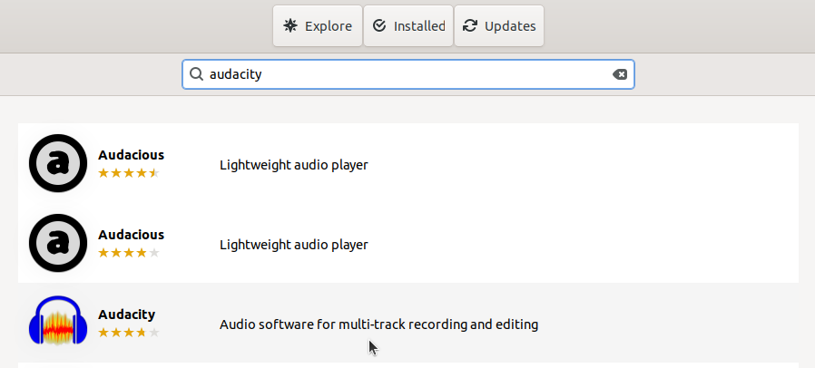

# Instalasi Audacity
Audacity adalah perangkat lunak pengedit audio open-source yang populer, digunakan untuk merekam, mengedit, dan memanipulasi suara. Audacity sering digunakan oleh podcaster, musisi, dan profesional audio untuk melakukan editing suara yang kompleks, mencampur beberapa trek audio, serta menambah efek suara. Audacity mendukung berbagai format audio, termasuk WAV, MP3, dan OGG, dan menawarkan berbagai alat untuk pemotongan, penggabungan, serta pengaturan kualitas suara.
## Langkah-Langkah Instalasi
### 1. Buka Ubuntu Software
Untuk membuka ubuntu software dapat mengklik icon ubuntu software pada menu applications.

### 2. Cari Audacity
Klik icon search pada pojok kiri atas ubuntu software kemudian masukkan keyword "Audacity".

### 3. Install Audacity
Pilih software yang sesuai kemudian tekan tombol install.

### 4. Verifikasi Instalasi
Tunggu hingga proses instalasi selesai, audacity yang sudah terinstall dapat ditemukan pada menu Applications.
Berikut adalah audacity ketika berjalan di Ubuntu 22.04 LTS.

