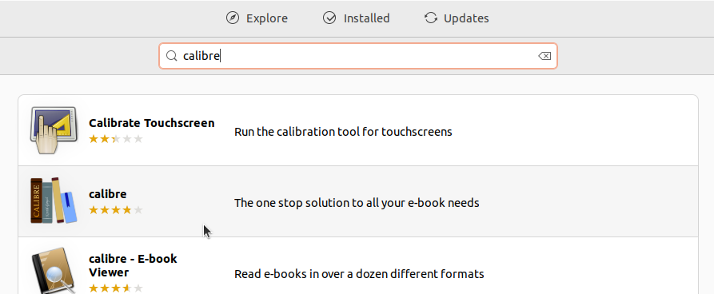
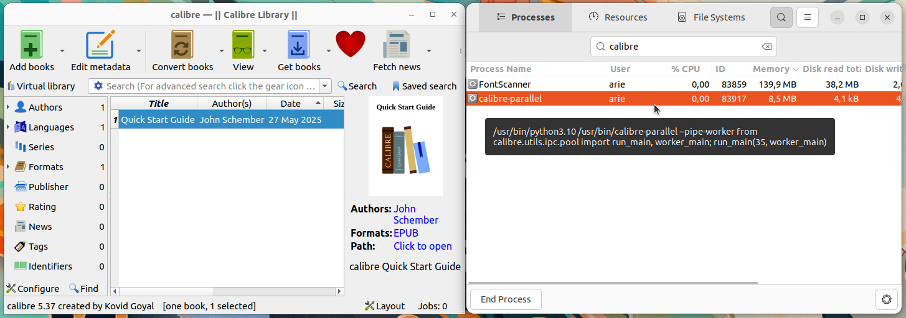

# Instalasi Calibre
Calibre adalah aplikasi manajemen eBook lintas platform yang digunakan untuk membaca, mengatur, mengonversi, dan mentransfer koleksi buku digital. Calibre mendukung berbagai format eBook seperti EPUB, MOBI, AZW3, PDF, dan lainnya. Aplikasi ini dilengkapi dengan fitur-fitur seperti editor metadata, pengonversi format, pembaca eBook terintegrasi, sinkronisasi ke perangkat eReader, dan server eBook lokal. Calibre sangat populer di kalangan pelajar, akademisi, dan penggemar literatur digital.
## Langkah-Langkah Instalasi
### 1. Buka Ubuntu Software
Untuk membuka ubuntu software dapat mengklik icon ubuntu software pada menu applications.

### 2. Cari Calibre
Klik icon search pada pojok kiri atas ubuntu software kemudian masukkan keyword "Calibre".

### 3. Install Calibre
Pilih software yang sesuai kemudian tekan tombol install.

### 4. Verifikasi Instalasi
Tunggu hingga proses instalasi selesai, Calibre yang sudah terinstall dapat ditemukan pada menu Applications.
Berikut adalah Calibre ketika berjalan di Ubuntu 22.04 LTS.

