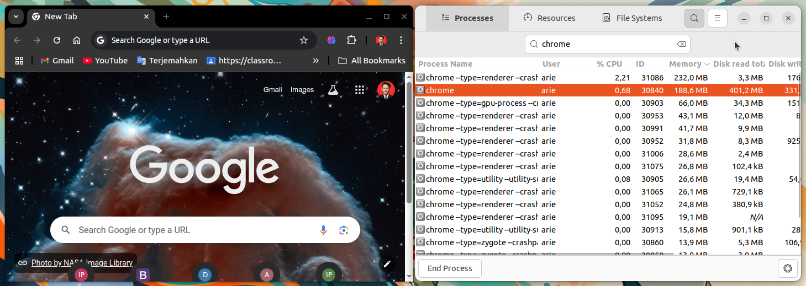

# Instalasi Google Chrome
Google Chrome merupakan salah satu peramban (browser) modern yang dikembangkan oleh Google dan banyak digunakan dalam dunia pendidikan, riset, serta pengembangan perangkat lunak karena mendukung berbagai fitur web terbaru dan memiliki ekosistem ekstensi yang luas.
## Langkah-Langkah Instalasi
### 1. Unduh File Instalasi Google Chrome
Kunjungi https://www.google.com/chrome/?platform=linux  kemudian unduh file instalasi untuk sistem operasi ubuntu.


### 2. Install Google Chrome
Pada terminal masuk ke direktori tempat file instalasi google chrome disimpan (biasanya terletak pada direktori Downloads), gunakan perintah berikut untuk berpindah direktori: 
```bash
cd Downloads/
```
Berikut adalah output jika telah berpindah direktori:
```bash
arie@zeno:~/Downloads$ 
```
Kemudian gunakan perintah berikut untuk melakukan instalasi goole chrome:
```bash
sudo dpkg -i google-chrome-stable_current_amd64.deb
```
Jika instalasi berhasil outputnya akan seperti berikut:
```bash
Selecting previously unselected package google-chrome-stable.
(Reading database ... 356731 files and directories currently installed.)
Preparing to unpack google-chrome-stable_current_amd64.deb ...
Unpacking google-chrome-stable (135.0.7049.84-1) ...
Setting up google-chrome-stable (135.0.7049.84-1) ...
```
### 3. Verifikasi Instalasi
Google Chrome yang sudah terinstall dapat ditemukan pada menu Applications.
Berikut adalah Google Chrome ketika berjalan di Ubuntu 22.04 LTS.

