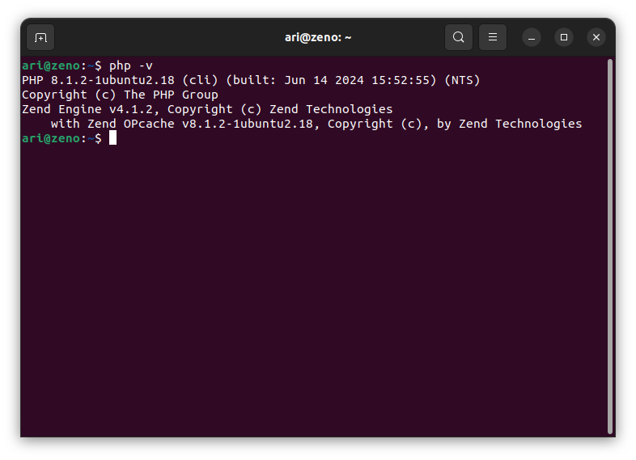

# Instalasi Composer

Untuk menginstall **Composer** pastikan **PHP** sudah terinstall terlebih dahulu pada sistem operasi, periksa versi **PHP** yang sudah terinstall dengan perintah `php -V`.

Kemudian download **composer** dengan perintah `curl -sS https://getcomposer.org/installer -o composer-setup.php`, setelah itu install **composer** menggunakan perintah `sudo php composer-setup.php --install-dir=/usr/local/bin --filename=composer`.

Cek versi **composer** untuk memastikan **composer** sudah terinstall pada sistem operasi dengan perintah `composer -V`.

