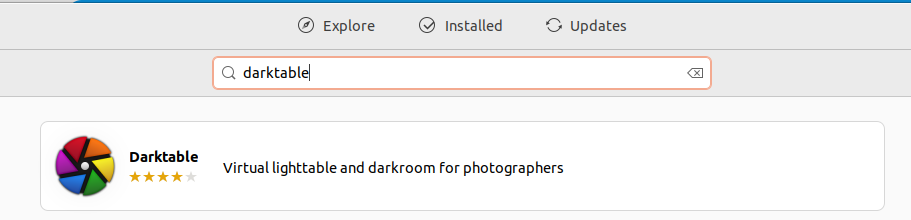
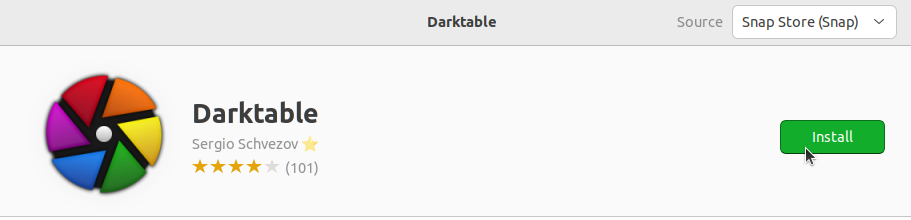
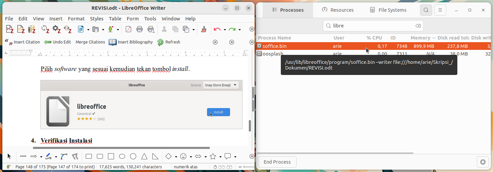

# Instalasi Darktable
Darktable adalah aplikasi open-source untuk pengeditan dan pengelolaan foto, terutama difokuskan pada file RAW dari kamera digital. Darktable bekerja seperti virtual lighttable dan darkroom, memungkinkan fotografer melakukan pengolahan gambar non-destruktif, mulai dari penyesuaian eksposur, kontras, warna, hingga retouching lanjutan. Aplikasi ini sangat populer di kalangan fotografer profesional sebagai alternatif gratis untuk Adobe Lightroom.
## Langkah-Langkah Instalasi
### 1. Buka Ubuntu Software
Untuk membuka ubuntu software dapat mengklik icon ubuntu software pada menu applications.

### 2. Cari Darktable
Klik icon search pada pojok kiri atas ubuntu software kemudian masukkan keyword "Darktable".

### 3. Install Darktable
Pilih software yang sesuai kemudian tekan tombol install.

### 4. Verifikasi Instalasi
Tunggu hingga proses instalasi selesai, Darktable yang sudah terinstall dapat ditemukan pada menu Applications.
Berikut adalah Darktable ketika berjalan di Ubuntu 22.04 LTS.

