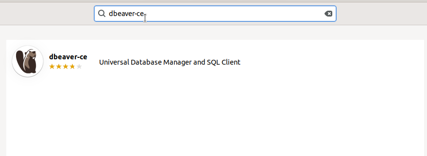
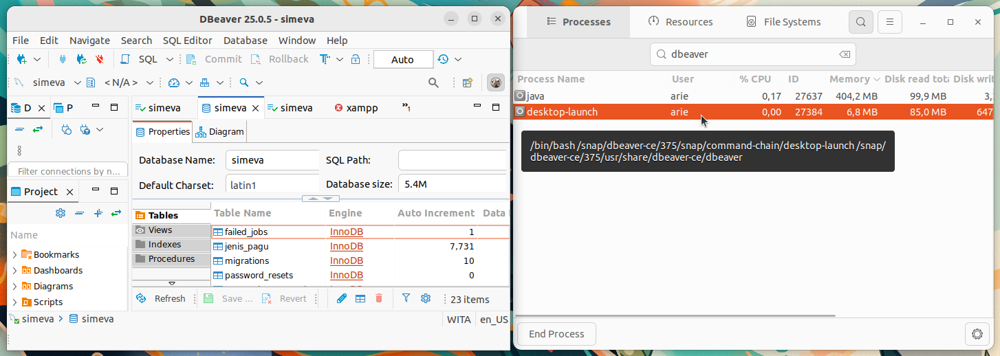

# Instalasi Dbeaver-ce
DBeaver adalah aplikasi manajemen basis data universal yang mendukung berbagai jenis sistem manajemen basis data (DBMS), termasuk MySQL, PostgreSQL, SQLite, Oracle, dan lainnya. DBeaver dirancang untuk memberikan antarmuka grafis yang intuitif dan mudah digunakan untuk pengelolaan basis data, query, dan administrasi basis data. Aplikasi ini sering digunakan oleh pengembang dan administrator basis data untuk memudahkan interaksi dengan database tanpa perlu menulis query SQL secara langsung atau menggunakan antarmuka berbasis baris perintah.
## Langkah-Langkah Instalasi
### 1. Buka Ubuntu Software
Untuk membuka ubuntu software dapat mengklik icon ubuntu software pada menu applications.

### 2. Cari Dbeaver-ce
Klik icon search pada pojok kiri atas ubuntu software kemudian masukkan keyword "Dbeaver-ce".

### 3. Install Dbeaver-ce
Pilih software yang sesuai kemudian tekan tombol install.

### 4. Verifikasi Instalasi
Tunggu hingga proses instalasi selesai, Dbeaver-ce yang sudah terinstall dapat ditemukan pada menu Applications.
Berikut adalah Dbeaver-ce ketika berjalan di Ubuntu 22.04 LTS.

