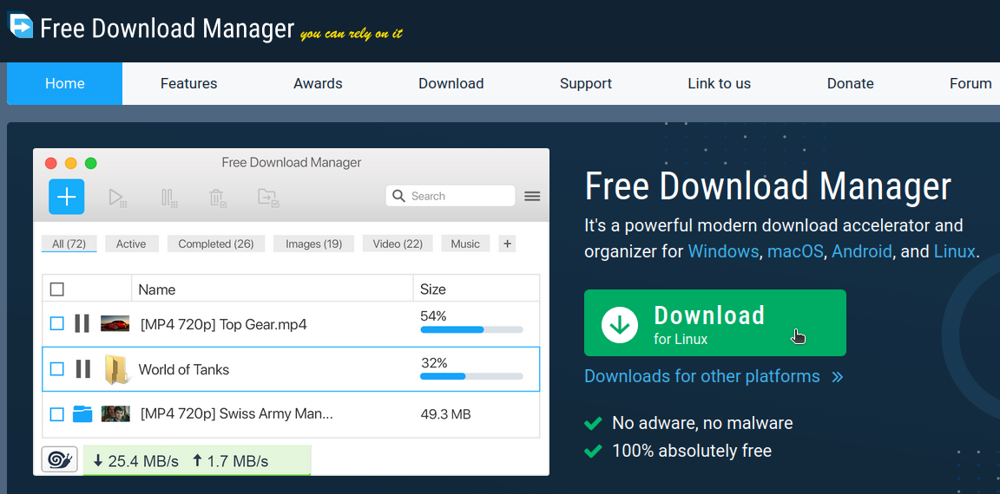
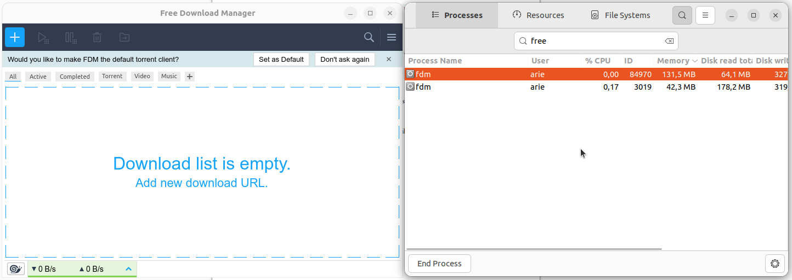

# Instalasi Free Download Manager
Free Download Manager adalah platform komunikasi video populer yang mendukung pertemuan daring, webinar dan konferensi. Free Download Manager sangat banyak digunakan dalam lingkungan pendidikan termasuk pembelajaran jarak jauh, kuliah online, serta presentasi skripsi. Ketersediaan aplikasi Free Download Manager untuk Linux termasuk Ubuntu memungkinkan pengguna di platform ini tetap dapat mengikuti kegiatan akademik secara penuh.
## Langkah-Langkah Instalasi
### 1. Unduh File Instalasi Free Download Manager
Kunjungi https://www.freedownloadmanager.org/   kemudian unduh file instalasi untuk sistem operasi Linux.




### 2. Install Free Download Manager
Pada terminal masuk ke direktori tempat file instalasi visual studio code disimpan (biasanya terletak pada direktori Downloads), gunakan perintah berikut untuk berpindah direktori: 
```bash
cd Downloads/
```
Berikut adalah output jika telah berpindah direktori:
```bash
arie@zeno:~/Downloads$ 

```
Kemudian gunakan perintah berikut untuk melakukan instalasi free download manager:
```bash
sudo dpkg -i freedownloadmanager.deb
```
Jika instalasi berhasil outputnya akan seperti berikut:
```bash
Selecting previously unselected package freedownloadmanager.
(Reading database ... 357497 files and directories currently installed.)
Preparing to unpack freedownloadmanager.deb ...
Unpacking freedownloadmanager (6.26.2.6190) ...
Setting up freedownloadmanager (6.26.2.6190) ...
```
### 3. Verifikasi Instalasi
Free Download Manager yang sudah terinstall dapat ditemukan pada menu Applications. 
Berikut adalah Free Download Manager ketika berjalan di Ubuntu 22.04 LTS.


