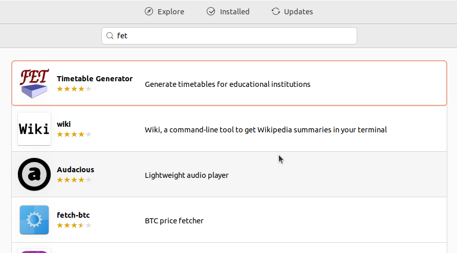
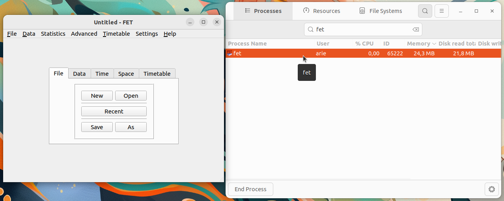

# Instalasi FET Timetable Generator
FET Timetable Generator adalah perangkat lunak open source yang dirancang untuk menghasilkan jadwal pelajaran atau kegiatan secara otomatis. Aplikasi ini dikembangkan untuk membantu sekolah, universitas, atau institusi pendidikan dalam menyusun jadwal berdasarkan data yang dimasukkan dan aturan-aturan yang ditetapkan seperti jumlah jam pelajaran, ketersediaan guru, ruang kelas, serta pembagian kelas dan mata pelajaran.
### 1. Buka Ubuntu Software
Untuk membuka ubuntu software dapat mengklik icon ubuntu software pada menu applications.

### 2. Cari FET Timetable Generator
Klik icon search pada pojok kiri atas ubuntu software kemudian masukkan keyword "FET Timetable Generator".

### 3. Install FET Timetable Generator
Pilih software yang sesuai kemudian tekan tombol install.

### 4. Verifikasi Instalasi
Tunggu hingga proses instalasi selesai, FET Timetable Generator yang sudah terinstall dapat ditemukan pada menu Applications.
Berikut adalah FET Timetable Generator ketika berjalan di Ubuntu 22.04 LTS.

