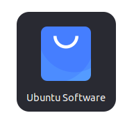

# Instalasi Figma
Figma adalah alat desain berbasis web yang sangat populer untuk desain antarmuka pengguna (UI), prototyping, dan kolaborasi tim. Figma memungkinkan pengguna untuk bekerja secara real-time dengan anggota tim lain, membuat desain, dan berkolaborasi dalam satu platform tanpa perlu khawatir tentang kompatibilitas perangkat atau sistem operasi. Dengan berbagai fitur, seperti desain vektor, prototyping interaktif, dan kemampuan untuk membuat desain responsif, Figma menjadi pilihan utama bagi banyak desainer UX/UI dan pengembang aplikasi.
## Langkah-Langkah Instalasi
### 1. Buka Ubuntu Software
Untuk membuka ubuntu software dapat mengklik icon ubuntu software pada menu applications.

### 2. Cari Figma
Klik icon search pada pojok kiri atas ubuntu software kemudian masukkan keyword "Figma".

### 3. Install Figma
Pilih software yang sesuai kemudian tekan tombol install.

### 4. Verifikasi Instalasi
Tunggu hingga proses instalasi selesai, Figma yang sudah terinstall dapat ditemukan pada menu Applications.
Berikut adalah Figma ketika berjalan di Ubuntu 22.04 LTS.

