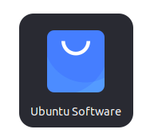
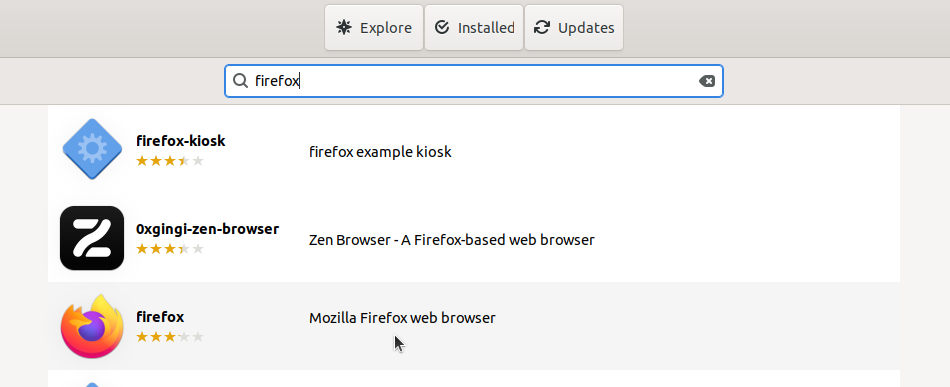

# Instalasi Firefox
Mozilla Firefox adalah peramban web open-source yang dikembangkan oleh Mozilla Foundation. Firefox dikenal dengan komitmennya terhadap standar web terbuka, perlindungan privasi, dan kustomisasi antarmuka.
## Langkah-Langkah Instalasi
### 1. Buka Ubuntu Software
Untuk membuka ubuntu software dapat mengklik icon ubuntu software pada menu applications.

### 2. Cari Firefox
Klik icon search pada pojok kiri atas ubuntu software kemudian masukkan keyword "Firefox".

### 3. Install Firefox
Pilih software yang sesuai kemudian tekan tombol install.

### 4. Verifikasi Instalasi
Tunggu hingga proses instalasi selesai, Firefox yang sudah terinstall dapat ditemukan pada menu Applications.
Berikut adalah Firefox ketika berjalan di Ubuntu 22.04 LTS.

