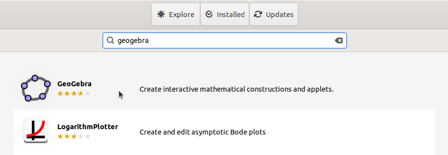
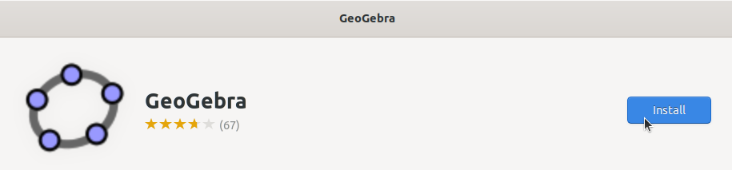
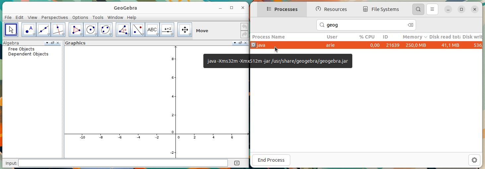

# Instalasi Geogebra
GeoGebra adalah perangkat lunak open-source yang digunakan untuk pendidikan matematika, baik di tingkat sekolah maupun Universitas. GeoGebra menyediakan berbagai alat untuk geometri, aljabar, kalkulus, statistik, dan banyak lagi, yang memungkinkan pengguna untuk mengeksplorasi konsep matematika secara interaktif. GeoGebra digunakan oleh guru, siswa, dan peneliti untuk memvisualisasikan dan menganalisis objek matematis dalam berbagai bentuk, seperti grafik fungsi, geometri dinamis, dan data statistik.
## Langkah-Langkah Instalasi
### 1. Buka Ubuntu Software
Untuk membuka ubuntu software dapat mengklik icon ubuntu software pada menu applications.

### 2. Cari Geogebra
Klik icon search pada pojok kiri atas ubuntu software kemudian masukkan keyword "Geogebra".

### 3. Install Geogebra
Pilih software yang sesuai kemudian tekan tombol install.

### 4. Verifikasi Instalasi
Tunggu hingga proses instalasi selesai, Geogebra yang sudah terinstall dapat ditemukan pada menu Applications.
Berikut adalah Geogebra ketika berjalan di Ubuntu 22.04 LTS.

