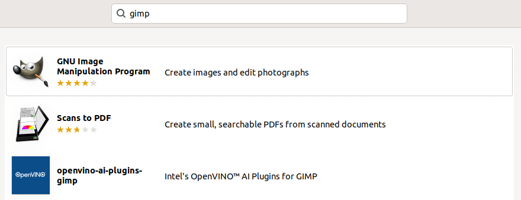
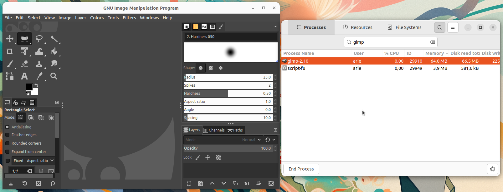

# Instalasi GIMP
GIMP (GNU Image Manipulation Program) adalah perangkat lunak pengedit gambar open-source yang dapat digunakan untuk berbagai keperluan, termasuk pengeditan foto, manipulasi gambar, pembuatan desain grafis, serta pembuatan ilustrasi digital.
Sebagai alternatif gratis untuk Adobe Photoshop, GIMP menawarkan berbagai fitur canggih seperti layer, masking, filter, scripting, dan dukungan untuk berbagai format file gambar, termasuk PNG, JPEG, PSD, dan GIF.
## Langkah-Langkah Instalasi
### 1. Buka Ubuntu Software
Untuk membuka ubuntu software dapat mengklik icon ubuntu software pada menu applications.

### 2. Cari GIMP
Klik icon search pada pojok kiri atas ubuntu software kemudian masukkan keyword "GIMP".

### 3. Install GIMP
Pilih software yang sesuai kemudian tekan tombol install.

### 4. Verifikasi Instalasi
Tunggu hingga proses instalasi selesai, Gimp yang sudah terinstall dapat ditemukan pada menu Applications.
Berikut adalah GIMP ketika berjalan di Ubuntu 22.04 LTS.

