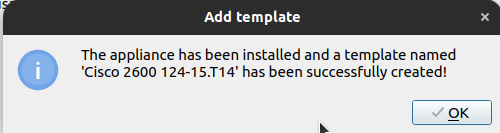

# Instalasi GNS3
## Pendahuluan
GNS3 (Graphical Network Simulator 3) merupakan perangkat lunak yang memungkinkan simulasi jaringan komputer secara virtual tanpa memerlukan perangkat keras fisik. Perangkat lunak ini mendukung berbagai teknologi jaringan, seperti Cisco IOS, MikroTik, Juniper, dan perangkat lain yang kompatibel dengan virtualisasi.

### 1. Perbarui Daftar Paket
Sebelum memulai proses instalasi perbarui daftar paket sistem dengan menjalankan perintah berikut:
```bash
sudo apt update && sudo apt upgrade -y
```
### 2. Menambahkan Repository Resmi GNS3
Tambahkan repository resmi GNS3 untuk mendapatkan versi terbaru: 
```
sudo add-apt-repository ppa:gns3/ppa -y
```
Kemudian perbarui kembali daftar paket:
```
sudo apt update
```
### 3. Menginstal GNS3 dan Dependensi
Jalankan perintah berikut untuk menginstal GNS3:
sudo apt install gns3-gui gns3-server -y 
Jika jendela configure ubridge muncul pilih yes. Kemudian jika instalasi berhasil output baris terakhirnya akan seperti berikut:
```bash
Processing triggers for libglib2.0-0:amd64 (2.72.4-0ubuntu2.4) ...
Processing triggers for libglib2.0-0:i386 (2.72.4-0ubuntu2.4) ...
Processing triggers for libc-bin (2.35-0ubuntu3.9) ...
Processing triggers for man-db (2.10.2-1) ...
Setting up gns3-gui (2.2.53~jammy1) ...
   ```
### 4. Konfigurasi Izin Pengguna
Agar GNS3 dapat berjalan dengan optimal tambahkan pengguna ke grup berikut:
```
sudo usermod -aG ubridge $USER 
sudo usermod -aG libvirt $USER 
sudo usermod -aG kvm $USER 
sudo usermod -aG wireshark $USER
```
Kemudian lakukan restart sistem agar perubahan diterapkan :
```
reboot
```
### 5. Install Dynamips
Jika ingin menggunakan Dynamips (Cisco Router Emulator) install dependensinya:
```
sudo apt install dynamips -y
```
### 6. Install Qemu
Jika ingin menggunakan appliance berbasis QEMU install paket qemu:
```
sudo apt install qemu-kvm qemu-utils libvirt-daemon-system virt-manager -y
``` 
### 7. Menjalankan GNS3
GNS3 yang sudah terinstall dapat ditemukan pada menu show applications atau dapat menggunakan perintah berikut pada terminal:
```
gns3
```
Pada saat pertama kali menjalankan GNS3 akan muncuk jendela wizard untuk konfigurasi server, pilih “run appliance on my local computer“ kemdian klik next.


Pada jendela selanjutnya biarkan tetap default kemudian klik Next sampai terdapat tulisan:
```
Connection to the local GNS3 server has been successful!
```

### 8. Menambahkan Appliance
Agar dapat menggunakan berbagai perangkat jaringan tambahan perlu menambahkan appliance ke dalam GNS3.
#### Menambahkan Appliance dengan KVM/QEMU.
1. **Unduh appliance/perangkat**<br>
   Unduh appliance/perangkat yang ingin ditambakan dalam bentuk image file, berikut merupakan link untuk mengunduh appliance (dalam kasus ini router cisco 2600) : <br>
   [[GNS3 Appliances](https://software.cisco.com/download/)](https://software.cisco.com/download/)

2. **Import Aplliance File**<br>
   Klik file pada menu pojok kiri atas kemudian pilih new tamplate.

   

   Selanjutnya pilih Install an appliance from the GNS3 server (recommendation).
   
   
   
   Kemudian jendela selanjutnya akan menampilkan daftar perangkat yang dapat ditambahkan (Firewalls, Guests, Routers dan Switches).
   Pilih perangkat yang akan di install (pada kasus ini Router Cisco 1700) kemudian klik install.
   
   
    
   Selanjutnya jika file appliance sudah di unduh sebelumnya maka statusnya akan Ready to install. 
   
   
   
   Kemudian klik next sampai terdapat pemberitahuan bahwa appliance telah berhasil di install.
   
   
   
3. **Verifikasi Instalasi**<br>
   Jika appliance berhasil di install maka pada menu appliance kategori router akan terdapat appliance yang baru saja ditambahkan.
   
   

3. **Uji Coba Perangkat**<br>
   Tambahkan 1 buah router cisco 2600 dan 2 VPCS kedalam workspace kemudian koneksikan setiap VPCS dengan router : <br>
   • PC 1 > ethernet 0/0 <br>
   • PC 2 > ethernet 1/0

   

   Kemudian klik kanan pada router lalu pilih console untuk menambahkan konfigurasi. Berikut konfigurasi untuk router cisco 2600 :
   
   **• Masuk mode konfigurasi** <br>
   ```bash
   enable
   configure terminal
   ```
   Jika berhasil maka outputnya akan seperti berikut :
   ```
   Enter configuration commands, one per line.  End with CNTL/Z.
   R1(config)#
   ```
   **• Konfigurasi FastEthernet0/0 (PC 1)**<br>
   ```
   interface FastEthernet0/0
   ip address 192.168.1.1 255.255.255.0
   no shutdown
   exit
   ```
   Jika berasil maka outputnya akan seperti berikut :
   ```
   *Mar  1 00:14:26.404: %LINK-3-UPDOWN: Interface Ethernet0/0, changed state to up
   *Mar  1 00:14:27.405: %LINEPROTO-5-UPDOWN: Line protocol on Interface Ethernet0/0, changed state to up
   ```
   **• Konfigurasi FastEthernet0/1 (PC 2)**<br>
   ```
   interface FastEthernet0/0
   ip address 192.168.2.1 255.255.255.0
   no shutdown
   exit
   ```
   Jika berhasil maka outputnya akan seperti berikut :
   ```
   *Mar  1 00:20:21.097: %LINK-3-UPDOWN: Interface Ethernet1/0, changed state to up
   *Mar  1 00:20:22.099: %LINEPROTO-5-UPDOWN: Line protocol on Interface Ethernet1/0, changed state to up
   ```
   **• Simpan Konfigurasi**<br>
   ```
   exit
   write memory
   Berikut adalah output setelah menyimpan konfigurasi :
   Overwrite the previous NVRAM configuration?[confirm]
   Building configuration…
   [OK]
   ```
   **• Konfigurasi VPCS**<br>
   Pada console PC 1 atur IP dengan :
   ```
   ip 192.168.1.2 255.255.255.0 192.168.1.1
   ```
   PC 2 :
   ```
   ip 192.168.2.2 255.255.255.0 192.168.2.1
   ```
   **• Uji Koneksi**<br>
   Ping dari PC 1 ke PC 2 :
   ```
   PC1> ping 192.168.2.2
   84 bytes from 192.168.2.2 icmp_seq=1 ttl=63 time=12.978 ms
   84 bytes from 192.168.2.2 icmp_seq=2 ttl=63 time=15.709 ms
   84 bytes from 192.168.2.2 icmp_seq=3 ttl=63 time=16.068 ms
   84 bytes from 192.168.2.2 icmp_seq=4 ttl=63 time=15.385 ms
   84 bytes from 192.168.2.2 icmp_seq=5 ttl=63 time=16.071 ms
   ```
   Jika outputnya seperti diatas maka konfigurasi telah berhasil diterapkan.

  ---
#### Menambahkan Appliance dengan VirtualBox

1. **Unduh appliance/perangkat**<br>
   Unduh file appliance/perangkat jaringan yang ingin di install (dalam kasus ini router mikrotik CHR). Kunjungi laman [https://mikrotik.com/download](https://mikrotik.com/download) kemudian unduh file OVA template.

   

2. **Import Aplliance File**<br>
   Pada VirtualBox klik file kemudian pilih import appliance.
   
   

   Selanjutnya pada kolom source file pilih file mikrotik yang baru saja di downlod dengan ekstensi .OVA. Kemudian pada pilihan setting dapat mengganti nama appliance dengan Mikrotik CHR.
   
   
   
   Klik finish kemudian jika import berhasil maka appliance Mikrotik CHR akan ditambahkan.

3. **Mengubungkan VirtualBox Appliance dengan GNS3**<br>
   Pada GNS3 pilih menu edit kemudian preferences. Selanjutnya pada menu VirtualBox VMs klik new kemudian pada pilihan VM List pilih nama machine router yang di install pada virtualBox kemudian klik finish.

   
    
   Setelah berhasil menambahkan maka router akan ada pada list VirtualBox VMs Template.
   
   
   
   Klik edit pada template tersebut kemudian pilih kategorinya sebagai router.

---
#### Menambahkan Appliance dengan VMWare

1. **Unduh appliance/perangkat**<br>
   Unduh file appliance/perangkat jaringan yang ingin di install (dalam kasus ini router mikrotik CHR). Kunjungi laman [https://mikrotik.com/download](https://mikrotik.com/download) kemudian unduh file OVA template.

   

2. **Import Aplliance File**<br>
   Pada VMWare klik menu file kemudian open dan pilih file .OVA.
   
   

   Pada jendela selanjutnya sesuaikan nama appliance kemudian klik import.
   
   
   
   Klik finish kemudian jika import berhasil maka appliance Mikrotik CHR akan ditambahkan.

3. **Mengubungkan VirtualBox Appliance dengan GNS3**<br>
   Pada GNS3 pilih menu edit kemudian preferences. Selanjutnya pada menu VMWare VMs klik new kemudian pada pilihan VM List pilih nama appliance yang di sudah diimport lalu klik finish.

   
    
   Setelah berhasil menambahkan maka router akan ada pada list VMWare VMs Template.
   
   
   
   Klik edit pada template tersebut kemudian pilih kategorinya sebagai router.

### 9. Membuat Simulasi Sederhana (Mikrotik CHR)
Berikut adalah topologi jaringan sederhana yang akan dibuat.


- **Menambahkan device** <br>
  Untuk menambahkan device dapat dengan melakukan drag device yang tersedia ke ruang kerja kemudian hubungkan tiap device dengan link ke port yang tersedia.

  

  Disini untuk port 1 (ether1) mikrotik tersambung ke internet, port 2 dan port 3 masing-masing terhubung ke switch. Setelah semua device terhubung jalankan semua device dengan mengklik icon start pada menu bagian atas.
- **Konfigurasi Mikrotik dengan Winbox**<br>
  Buka aplikasi winbox yang terinstall pada laptop kemudian klik mac address / ip address yang muncul. Login dengan user defatl mikrotik yaitu user : admin dan passwordnya kosong.

  

- **Konfigurasi IP** <br>
  Pada winbox, klik menu ip > address. Secara otomatis port 1 akan mendapat ip dari internet karena terhubung dengan NAT pada port 1.

  

   - Port 2 : 192.168.2.1/24 <br>
  
   - Port 3 : 192.168.3.1/24 <br>
  

- **Menambahkan DHCP Server** <br>
  Pada winbox pilih ip > dhcp server. Kemudian klik DHCP Setup, pada jendela selanjutnya pilih interface yang akan dijadikan DHCP Server, disini yang pertama adalah ether 2.

  

  Selanjutnya biarkan secara default. Untuk range ip yang di berikan bisa dimodifikasi pada jendela selanjutnya. Untuk DNS server isi dengan 8.8.8.8. Klik next sampai terdapat pemberitahuan “setup has completed successfully”.

  

  Kemudian dengan cara yang sama lakukan untuk ether 3.

- **Cek IP client** <br>
  Pada semua VPCS buka console dengan cara klik kanan > console, pada console masukkan perintah :
  ```
  dhcp
  ```
  Perintah dhcp digunakan agar pc menerima ip dari dhcp server. Kemudian untuk melihat konfigurasi dhcp yang diterima gunakan perintah berikut :
  ```
  show ip
  ```
  Berikut output untuk PC1 :
  ```
  NAME        : PC1[1]
  IP/MASK     : 192.168.2.254/24
  GATEWAY     : 192.168.2.1
  DNS         : 192.168.122.1  
  DHCP SERVER : 192.168.2.1
  DHCP LEASE  : 1650, 1800/900/1575
  MAC         : 00:50:79:66:68:00
  LPORT       : 10014
  RHOST:PORT  : 127.0.0.1:10015
  MTU         : 1500
  Output untuk PC 4 :
  NAME        : PC4[1]
  IP/MASK     : 192.168.3.253/24
  GATEWAY     : 192.168.3.1
  DNS         : 8.8.8.8  
  DHCP SERVER : 192.168.3.1
  DHCP LEASE  : 1614, 1800/900/1575
  MAC         : 00:50:79:66:68:03
  LPORT       : 10036
  RHOST:PORT  : 127.0.0.1:10037
  MTU         : 1500
  ```
  Hal ini menunjukan bahwa konfigurasi DHCP Server telah berhasil. Kemudian juga dapa menguji koneksi dengan mengubungi PC dengan DHCP Server yang berbeda, contoh PC4 menghubungi PC1 dengan cara ping:
  ```
  PC4> ping 192.168.2.254

  84 bytes from 192.168.2.254 icmp_seq=1 ttl=63 time=3.874 ms
  84 bytes from 192.168.2.254 icmp_seq=2 ttl=63 time=2.473 ms
  84 bytes from 192.168.2.254 icmp_seq=3 ttl=63 time=0.863 ms
  84 bytes from 192.168.2.254 icmp_seq=4 ttl=63 time=1.328 ms
  84 bytes from 192.168.2.254 icmp_seq=5 ttl=63 time=1.230 ms
  ```
- **Konfigurasi IP Firewal**<br>
  Agar PC dapat terhubung ke internet maka perlu konfigurasi IP Firewal. Pada winbox pilih ip > firewal kemudian klik kolom NAT dan tambah rules baru dengan mengklik icon +.<br>
  Selanjut pada tab Action ubah menjadi “masquerade” kemudian klik ok.

  

  ji koneksi dengan ping ke 8.8.8.8.
  ```
  C4> ping 8.8.8.8

  4 bytes from 172.217.194.102 icmp_seq=1 ttl=57 time=47.240 ms
  4 bytes from 172.217.194.102 icmp_seq=2 ttl=57 time=78.903 ms
  4 bytes from 172.217.194.102 icmp_seq=3 ttl=57 time=44.574 ms
  4 bytes from 172.217.194.102 icmp_seq=4 ttl=57 time=61.156 ms
  4 bytes from 172.217.194.102 icmp_seq=5 ttl=57 time=46.509 ms
  ```
  Jika outputnya seperti diatas maka PC sudah dapat terkoneksi dengan internet.
