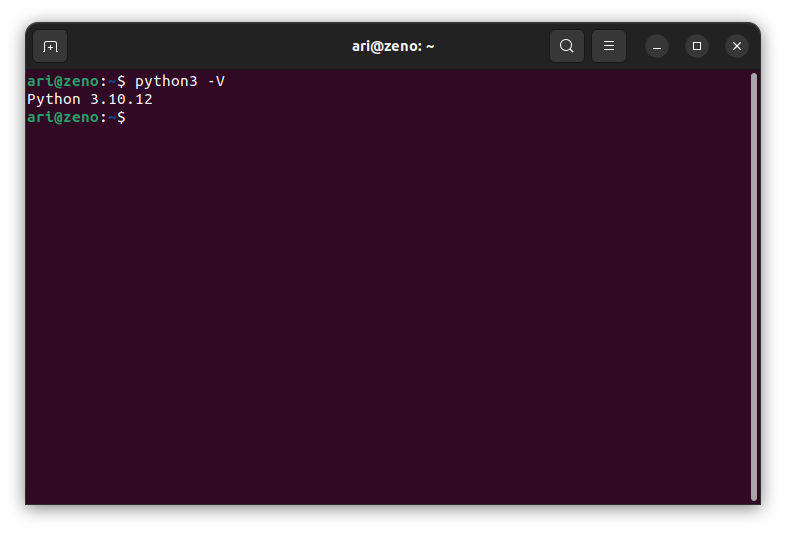
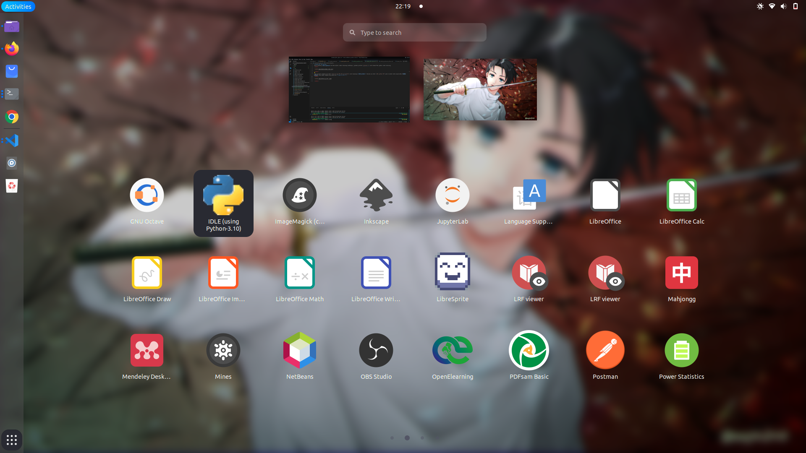

# Instalasi Idle Python
Untuk memasang **Idle Python** Pastikan Python sudah terpasang sebelumnya, gunakan perintah `python3 -V` untuk memastikan python sudah terpasang.

 

Pada terminal masukkan perintah `sudo apt install idle-python3.10` untuk memasang **idle python**. Gunakan perintah `idle-python3.10` pada terminal untuk menjalankan **idle python** atau dapat mengaksesnya pada menu ***applications***.

 

