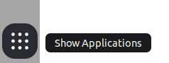
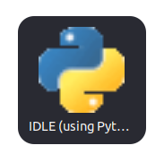
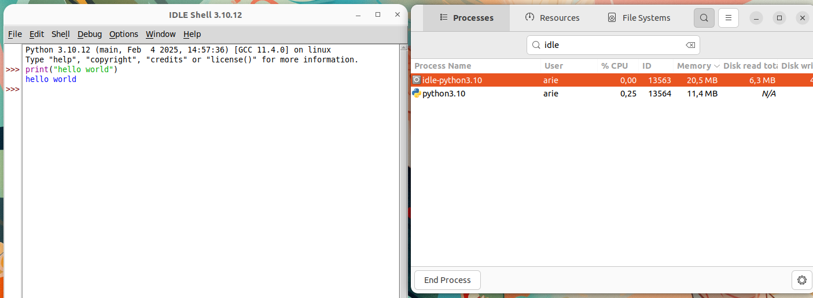

# Instalasi Idle Python

UIDLE (Integrated Development and Learning Environment) adalah IDE bawaan Python yang dikembangkan oleh Guido van Rossum, pencipta Python itu sendiri. IDLE dirancang untuk memberikan pengalaman pengkodean yang lebih nyaman bagi pemula dan pengguna yang ingin menulis serta menjalankan skrip Python dengan cepat tanpa perlu menginstal IDE yang lebih kompleks seperti PyCharm atau VS Code.

## Langkah-Langkah Instalasi

### 1. Perbarui Sistem

Gunakan perintah berikut untuk memperbarui sistem:

```bash
sudo apt update && sudo apt upgrade -y
```

### 2. Install IDLE

IDLE dapat dinstall menggunakan perintah berikut:

```bash
sudo apt install idle3 -y
Jika berhasil output baris terakhirnya akan seperti berikut:
Setting up idle-python3.10 (3.10.12-1~22.04.7) ...
Setting up idle (3.10.6-1~22.04.1) ...
Setting up idle3 (3.10.6-1~22.04.1) ...
Processing triggers for desktop-file-utils (0.26-
1ubuntu3) ...
Processing triggers for gnome-menus (3.36.0-1ubuntu3) ...
Processing triggers for man-db (2.10.2-1) ...
Processing triggers for mailcap (3.70+nmu1ubuntu1)
...
Processing triggers for fontconfig (2.13.1-
4.2ubuntu5) ...
```

### 3. Menjalankan IDLE Python

Setelah instalasi berhasil, IDLE dapat dijalankan melalui terminal atau menu aplikasi Ubuntu.

- Menjalankan IDLE dari Terminal
  Untuk membuka IDLE, jalankan perintah berikut di terminal:
  ```bash
  idle
  ```
  Kemudian jendela IDLE akan ditampilkan
- Menjalankan IDLE dari Menu Aplikasi<br>
  Klik ikon show applications pada bagian paling bawah dash Ubuntu.
  <center>

  

  </center>
  Cari “IDLE” kemudian klik ikon IDLE.
  <center>

  

  </center>
  Berikut adalah tampilan IDLE ketika berjalan di Ubuntu 22.04 LTS.
  <center>

  

  </center>
