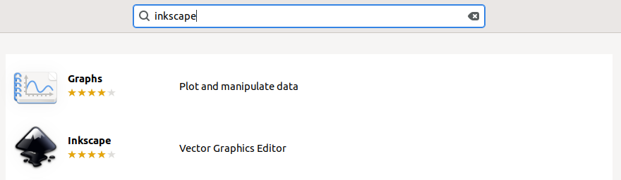
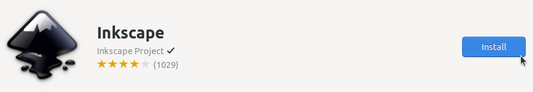
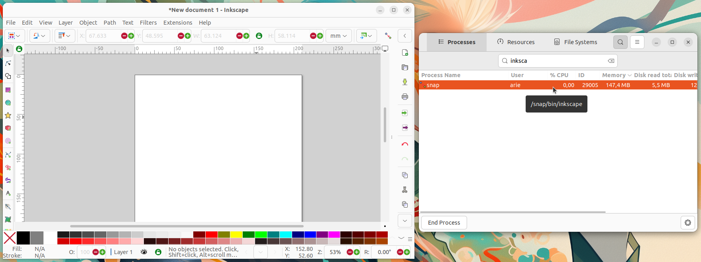

# Instalasi Inkscape
Inkscape adalah perangkat lunak open-source untuk pengeditan grafis vektor yang sering digunakan dalam desain ilustrasi, logo, dan gambar berbasis vektor lainnya. Inkscape mendukung format file SVG (Scalable Vector Graphics) secara default, serta berbagai format lainnya seperti PDF, EPS, AI, dan PNG.
Inkscape menjadi alternatif populer untuk perangkat lunak berbayar seperti CorellDraw karena fitur-fiturnya yang lengkap dan kemampuannya dalam mendukung berbagai jenis proyek desain grafis.
## Langkah-Langkah Instalasi
### 1. Buka Ubuntu Software
Untuk membuka ubuntu software dapat mengklik icon ubuntu software pada menu applications.

### 2. Cari Inkscape
Klik icon search pada pojok kiri atas ubuntu software kemudian masukkan keyword "Inkscape".

### 3. Install Inkscape
Pilih software yang sesuai kemudian tekan tombol install.

### 4. Verifikasi Instalasi
Tunggu hingga proses instalasi selesai, Inkscape yang sudah terinstall dapat ditemukan pada menu Applications.
Berikut adalah Inkscape ketika berjalan di Ubuntu 22.04 LTS.

