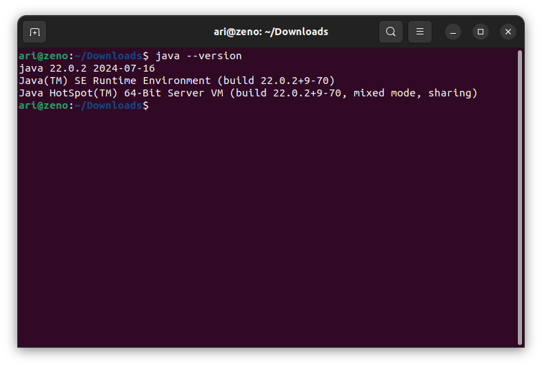

# Instalasi Java

Untuk menjalankan program **java** diperlukan **JDK (Java Development Kit)**, unduh **JDK** pada halaman [Download Java](https://www.oracle.com/id/java/technologies/downloads/). 

 

Setelah selesai mengunduh **JDK** install paket tersebut dengan perintah `sudo dpkg -i namafile.deb`. 

 

Setelah proses instalasi selesai gunakan perintah `java --version` untuk memeriksa versi **java** yang telah terinstall.

 

