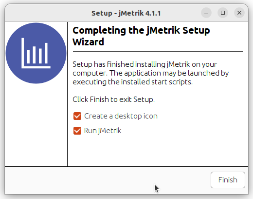
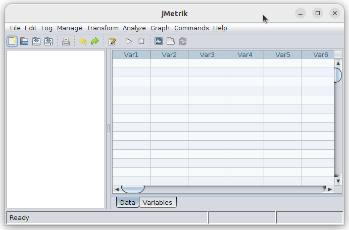

# Instalasi jMetrik
jMetrik adalah aplikasi open-source berbasis Java untuk analisis statistik dan pengukuran psikometrik, seperti analisis butir soal, uji reliabilitas, validitas, hingga teori respons butir (IRT). Aplikasi ini banyak digunakan dalam bidang pendidikan dan penelitian evaluasi untuk mengolah data hasil tes dan menyusun instrumen penilaian secara kuantitatif. jMetrik menawarkan antarmuka grafis yang intuitif dan mendukung berbagai format input data.
## Langkah-Langkah Instalasi
### 1. Unduh File Instalasi jMetrik
Kunjungi https://itemanalysis.com/jmetrik-download/ kemudian unduh file instalasi untuk sistem operasi Linux.

### 2. Install jMetrik
Pada terminal masuk ke direktori tempat file instalasi open eLearning disimpan (biasanya terletak pada direktori Downloads), gunakan perintah berikut untuk berpindah direktori: 
```bash
cd Downloads/
```
Berikut adalah output jika telah berpindah direktori:
```bash
arie@zeno:~/Downloads$ 
```
Kemudian gunakan perintah berikut untuk memberi izin eksekusi file:
```bash
chmod +x jmetrik_unix_4_1_1.sh
```
Kemudian jalankan file tersebut dengan perintah berikut:
```bash
./jmetrik_unix_4_1_1.sh
```
Kemudian wizard instalasi jMetrik akan muncul.



### 3. Verifikasi Instalasi
jMetrik yang sudah terinstall dapat ditemukan pada menu Applications. 
Berikut adalah jMetrik ketika berjalan di Ubuntu 22.04 LTS.


