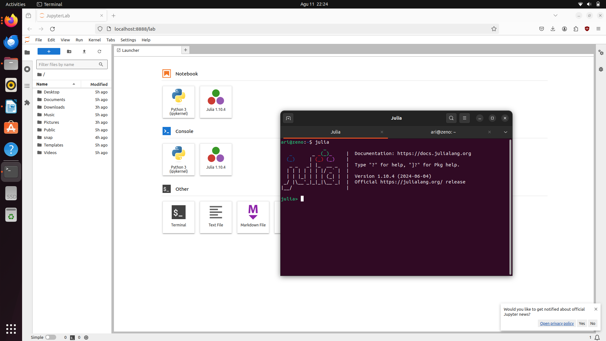

# Instalasi Julia dan Menambahkan Kernel Julia
Untuk menginstall **julia** pada terminal gunakan perintah `curl -fsSL https://install.julialang.org | sh`. Setelah installasi selesai masuk ke sesi **julia RPEL** dengan perintah `julia` pada terminal. Pada **julia RPEL** gunakan perintah `using Pkg` kemudian `Pkg.add(“Ijulia”)` untuk menambahkan **kernel julia** ke dalam **jupyterLab**. 

 

