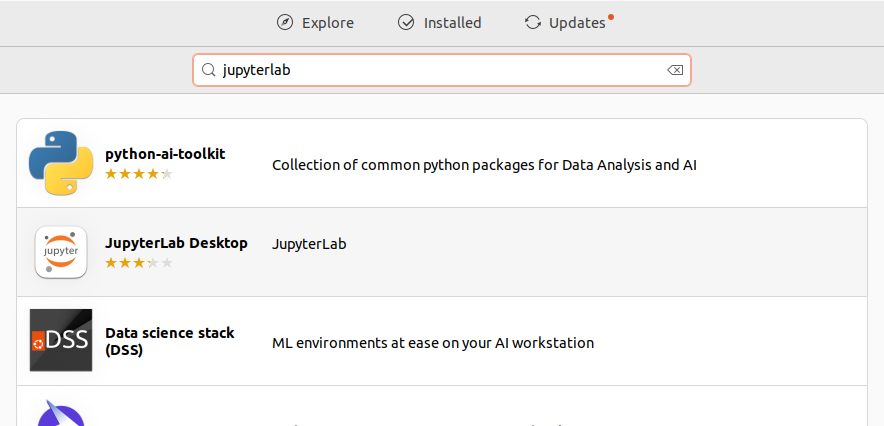
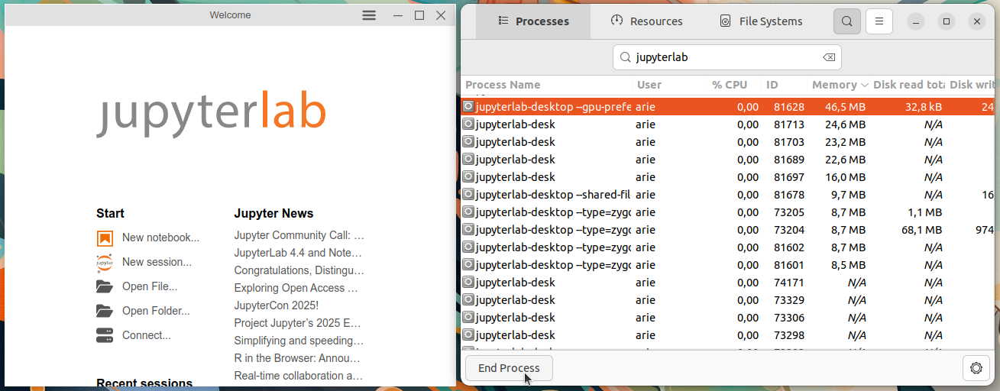

# Instalasi JupyterLab
JupyterLab adalah antarmuka berbasis web generasi terbaru dari Jupyter Notebook yang digunakan untuk membuat dan menjalankan kode Python secara interaktif. JupyterLab mendukung visualisasi data, integrasi terminal, teks Markdown, serta eksekusi skrip Python atau bahasa pemrograman lain melalui kernel. JupyterLab sangat cocok untuk pengembangan data science, machine learning, serta eksperimen berbasis notebook interaktif.
## Langkah-Langkah Instalasi
### 1. Buka Ubuntu Software
Untuk membuka ubuntu software dapat mengklik icon ubuntu software pada menu applications.

### 2. Cari JupyterLab
Klik icon search pada pojok kiri atas ubuntu software kemudian masukkan keyword "JupyterLab".

### 3. Install JupyterLab
Pilih software yang sesuai kemudian tekan tombol install.

### 4. Verifikasi Instalasi
Tunggu hingga proses instalasi selesai, JupyterLab yang sudah terinstall dapat ditemukan pada menu Applications.
Berikut adalah JupyterLab ketika berjalan di Ubuntu 22.04 LTS.

