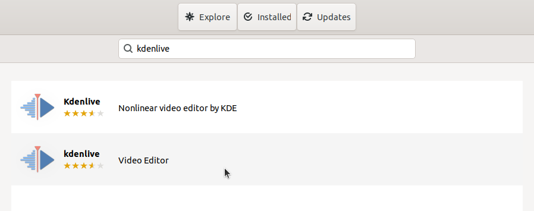
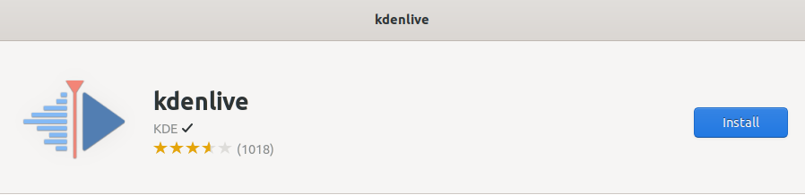
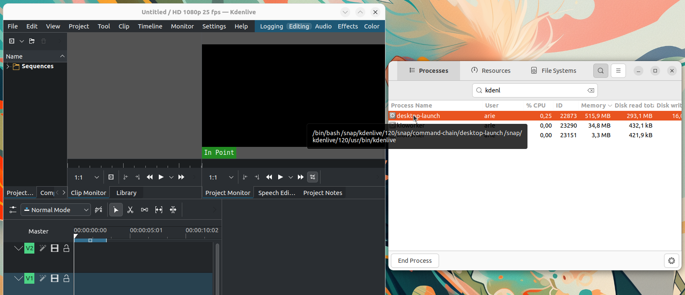

# Instalasi Kdenlive
Kdenlive (KDE Non-Linear Video Editor) adalah perangkat lunak pengedit video open-source yang dikembangkan oleh komunitas KDE. Kdenlive menawarkan berbagai fitur canggih yang biasa ditemukan di perangkat lunak pengeditan video profesional, seperti multi-track editing, efek video, transisi, dan pengeditan audio. Selain itu, Kdenlive mendukung berbagai format file video dan audio, menjadikannya pilihan populer bagi pengguna yang membutuhkan alat pengeditan video yang kuat dan fleksibel di platform Linux.
## Langkah-Langkah Instalasi
### 1. Buka Ubuntu Software
Untuk membuka ubuntu software dapat mengklik icon ubuntu software pada menu applications.

### 2. Cari Kdenlive
Klik icon search pada pojok kiri atas ubuntu software kemudian masukkan keyword "Kdenlive".

### 3. Install Kdenlive
Pilih software yang sesuai kemudian tekan tombol install.

### 4. Verifikasi Instalasi
Tunggu hingga proses instalasi selesai, Kdenlive yang sudah terinstall dapat ditemukan pada menu Applications.
Berikut adalah Kdenlive ketika berjalan di Ubuntu 22.04 LTS.

