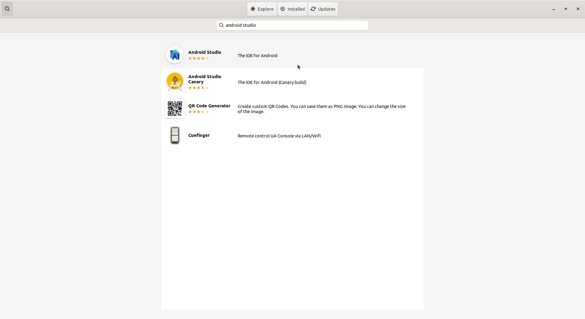
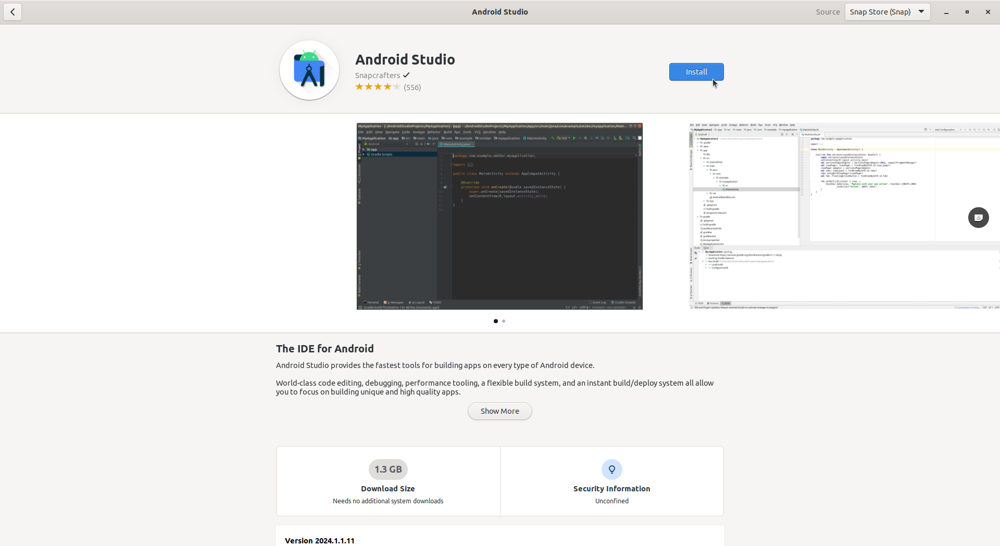

# Instalasi LibreOffice
Secara bawaan Ubuntu versi 22.04 LTS sudah terpasang **LibreOffice** versi 7.3.2.

 

Jika pada sistem operasi linux anda belum terpasang LibreOffice, ikuti langkah-langkah berikut untuk memasangnya.

1. Buka ***Ubuntu Software***.
   
 

   

   

2. Klik ***icon*** ***search*** pada pojok kiri atas aplikasi kemudian masukkan *keyword* "*LibreOffice*".
   
 

   

   

3. Pilih aplikasi yang sesuai kemudian tekan tombol **install**.
   
 

   

   

4. Tunggu hingga proses instalasi selesai, *LibreOffice* yang sudah terinstall dapat ditemukan pada menu ***Applications***.
    
 

   

   
