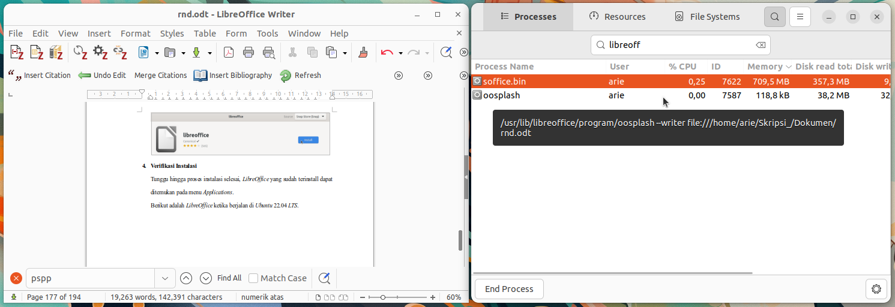

# Instalasi LibreOffice
LibreOffice adalah perangkat lunak perkantoran sumber terbuka yang dikembangkan oleh The Document Foundation. Aplikasi ini mencakup berbagai program penting seperti Writer (pengolah kata), Calc (spreadsheet), Impress (presentasi) dan lainnya. Berdasarkan dokumentasinya LibreOffice sepenuhnya kompatibel dengan format dokumen umum seperti .docx, .xlsx dan .pptx.
## Langkah-Langkah Instalasi
### 1. Buka Ubuntu Software
Untuk membuka ubuntu software dapat mengklik icon ubuntu software pada menu applications.

### 2. Cari LibreOffice
Klik icon search pada pojok kiri atas ubuntu software kemudian masukkan keyword "LibreOffice".

### 3. Install LibreOffice
Pilih software yang sesuai kemudian tekan tombol install.

### 4. Verifikasi Instalasi
Tunggu hingga proses instalasi selesai, LibreOffice yang sudah terinstall dapat ditemukan pada menu Applications. Terdapat 4 perangkat lunak yang terinstall yaitu LibreOffice Writer, LibreOffice Calc, LibreOffice Impress, dan LibreOffice Math.
Berikut adalah LibreOffice ketika berjalan di Ubuntu 22.04 LTS.

