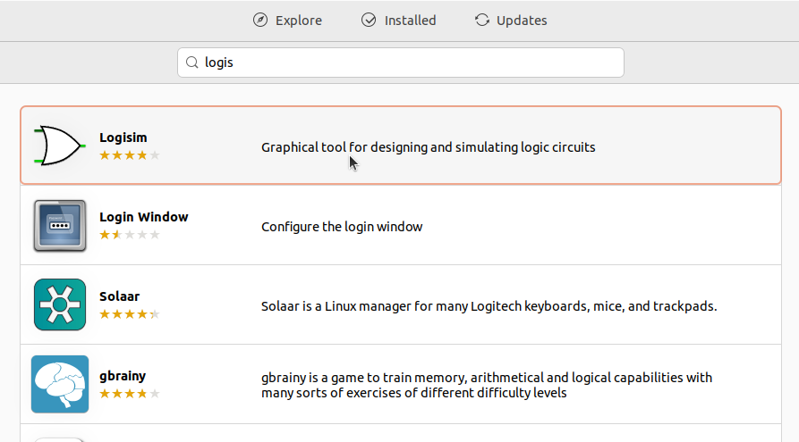
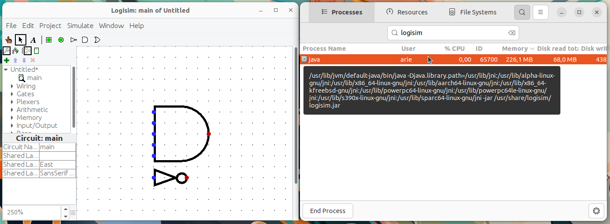

# Instalasi Logisim
Logisim adalah aplikasi simulasi logika digital berbasis grafis yang digunakan untuk merancang dan mensimulasikan rangkaian logika digital. Aplikasi ini sangat berguna untuk pembelajaran dasar sistem digital, seperti gerbang logika, flip-flop, hingga rangkaian arsitektur komputer.
## Langkah-Langkah Instalasi
### 1. Buka Ubuntu Software
Untuk membuka ubuntu software dapat mengklik icon ubuntu software pada menu applications.

### 2. Cari Logisim
Klik icon search pada pojok kiri atas ubuntu software kemudian masukkan keyword "Logisim".

### 3. Install Logisim
Pilih software yang sesuai kemudian tekan tombol install.

### 4. Verifikasi Instalasi
Tunggu hingga proses instalasi selesai, Logisim yang sudah terinstall dapat ditemukan pada menu Applications.
Berikut adalah Logisim ketika berjalan di Ubuntu 22.04 LTS.

