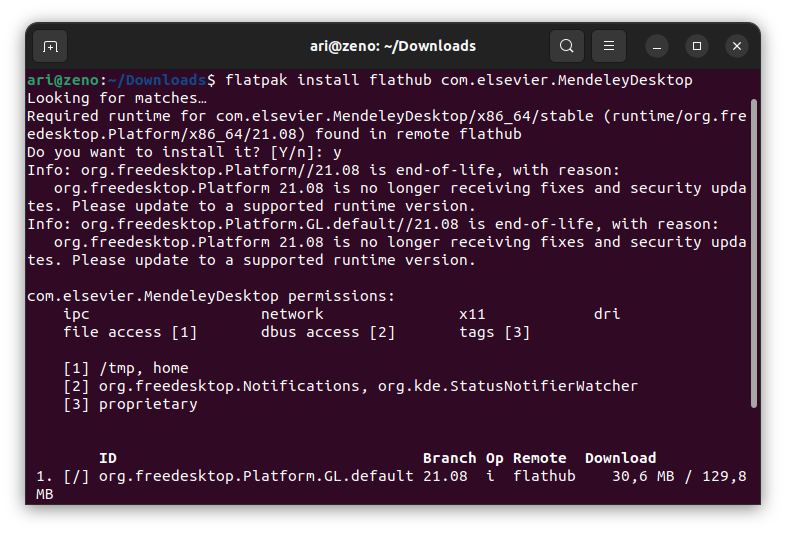

# Instalasi Mendeley
Untuk mendeley versi desktop dapat di install melalui paket **flatpak**.

kunjungi [flathub.org](https://flathub.org) kemudian cari '**mendeley**' untuk melihat perintah instalasinya.

install **mendeley** dengan perintah `flatpak install flathub com.elsevier.MendeleyDesktop`. 

Pada saat pertama kali membuka **mendeley** akan diminta login terlebih dahulu.

Berikut adalah gambar **mendeley** pada sistem operasi ubuntu.

# Mengintegrasikan LibreOffice Writer dengan mendeley
Untuk mengintegrasikan **LibreOffice Writer** dengan **mendeley** buka terlebih dahulu **libreOffice Writer** kemudian pada tab tools pilih **extension manager** atau tekan shortcut `CTRL + ALT E`.

Tambahkan extension **mendeley** dengan mengklik tombol `add` kemudian pilih **mendeley extension** yang berada pada `/var/lib/flatpak/app/com.elsevier.MendeleyDesktop/current/active/files/extra/share/mendeleydesktop/openOfficePlugin/Mendeley-x.xx.x.oxt`.

Setelah itu buka kembali **libreOffice Writer** dan **mendeley** sudah terintegrasi dengan **libreOffice Writer**.

