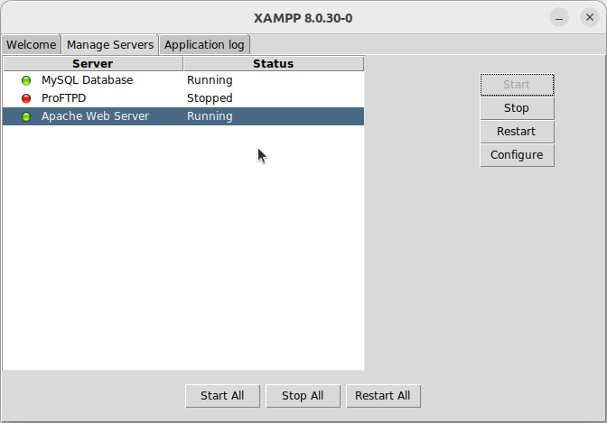
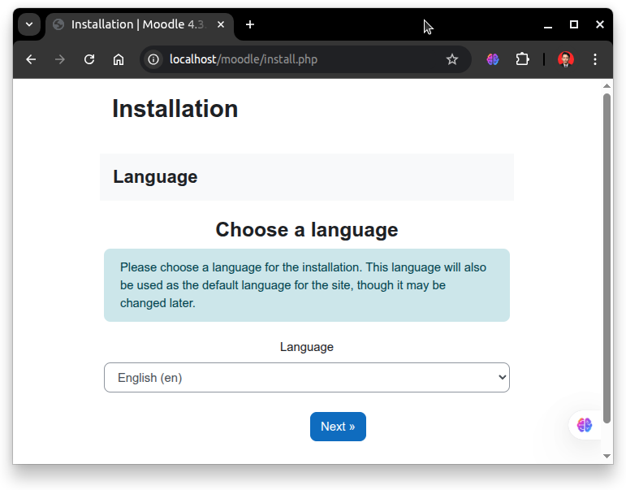

# Instalasi Moodle
Moodle adalah platform pembelajaran berbasis web (LMS – Learning Management System) bersifat open-source yang banyak digunakan oleh institusi pendidikan, perusahaan, dan komunitas pembelajaran. Moodle memungkinkan pembuatan kursus online lengkap dengan kuis, forum diskusi, tugas, materi ajar, dan fitur pelacakan pembelajaran. Karena dibangun dengan PHP dan MySQL/MariaDB, Moodle bisa dijalankan secara lokal menggunakan XAMPP untuk keperluan pengembangan atau pembelajaran.
## Langkah-Langkah Instalasi
### 1. Jalankan XAMPP
Gunakan perintah berikut untuk menjalankan XAMPP.
```bash
sudo ./xampp-linux-x64-8.0.30-0-installer.run
```
Kemudian pada jendela XAMPP jalankan service Apache Web Server dan MySQL Database.


### 2. Unduh Moodle
Kunjungi https://download.moodle.org/releases/supported/ kemudian unduh file instalasi untuk sistem operasi Linux. File yang didownload berekstensi .zip.

### 3. Ekstrak Moodle
Pada terminal masuk ke direktori tempat file instalasi Moodle disimpan (biasanya terletak pada direktori Downloads), gunakan perintah berikut untuk berpindah direktori: 
```bash
cd Downloads/
```
Berikut adalah output jika telah berpindah direktori:
```bash
arie@zeno:~/Downloads$ 
```
Kemudian gunakan perintah berikut untuk mengekstrak file wordpress:
```bash
unzip moodle-latest-405.zip
```
Pindahkan folder hasil ekstraksi ke direktori XAMPP:
```bash
sudo mv moodle /opt/lampp/htdocs/
```
Buat folder data Moodle
```bash
sudo mkdir /opt/lampp/moodledata
```

### 4. Konfigurasi Moodle
UnUntuk mengakses moodle kunjungi http://localhost/moodle pada browser.



Kemudian silahkan konfigurasi moodle sesuai kebutuhan.
