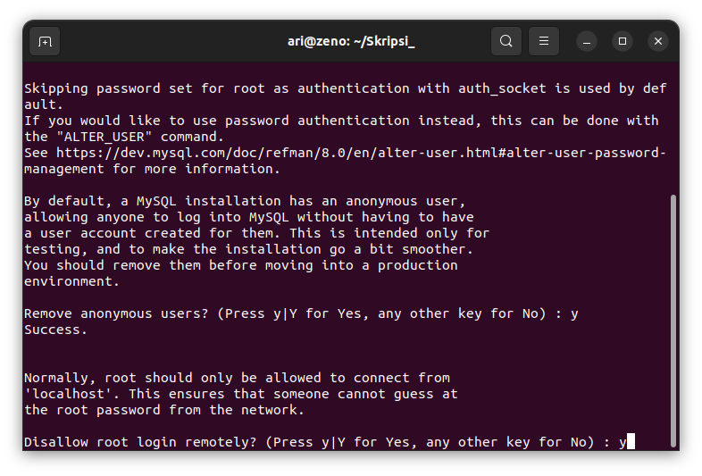
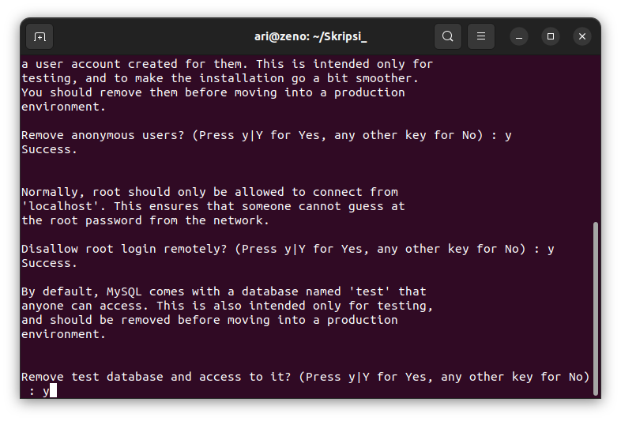
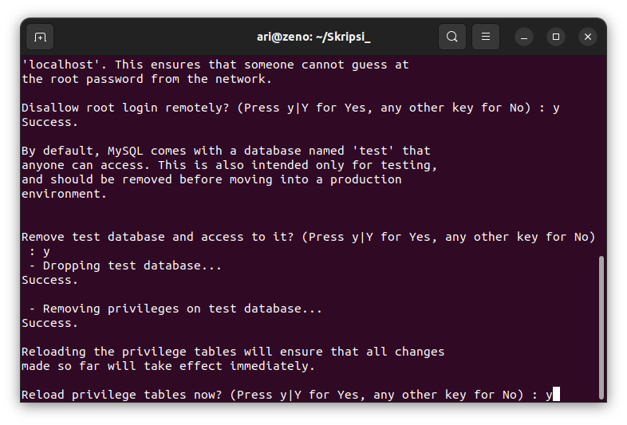
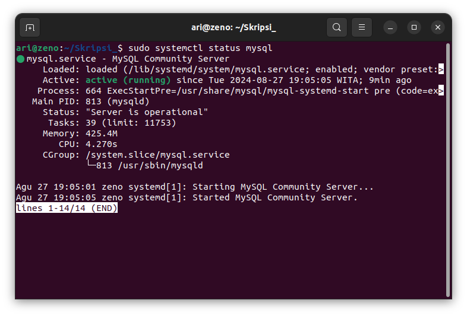
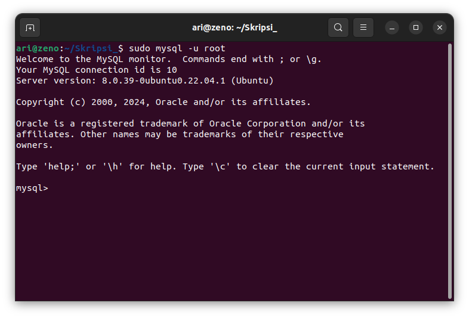

# Instalasi MySQL

## 1. Install MySQL Server
Setelah repository di update, install MySQL dengan perintah `sudo apt install mysql-server`

Pastikan MySQL sudah terinstall dengan perintah `mysqld --version`

## 2. Securing MySQL
Setelah menginstal MySQL langkah selanjutnya adalah melakukan pengaturan keamanan awal untuk instalasi MySQL. Pengamanan mencakup pengaturan kata sandi yang kuat, menghapus akun dan database yang tidak diperlukan dan membatasi akses untuk meningkatkan keamanan secara keseluruhan.
Untuk mengamankan installasi jalankan perintah `sudo mysql_secure_installation`.

### Validasi Password
Bagian pertama mengamankan instllasi adalah validasi password. Tekan y untuk mengkonfirmasi validasi password.

Pengguna memiliki tiga opsi untuk kebijakan kata sandi:
- 0 - low
- 1 - medium
- 2 - strong

Pilih salah satu kemudian tekan enter.

### Remove Anonymous Users
Setelah instalasi, MySQL secara otomatis menggabungkan pengguna anonim, memungkinkan akses tidak terbatas tanpa akun pengguna khusus. Meskipun awalnya dirancang untuk pengujian dan instalasi yang disederhanakan, disarankan untuk menghapus pengguna ini demi alasan keamanan.

### Disallow Root Login Remotely
Secara bawaan membatasi koneksi pengguna root ke mesin lokal (localhost) disarankan untuk mengurangi potensi risiko keamanan, seperti serangan brute force kredensial.

### Remove Test Database

### Reload Privilege Tables

## 3. Cek apakah MySQL Service telah berjalan
Setelah instalasi, layanan MySQL akan dimulai secara otomatis. Untuk memverifikasi bahwa server bekerja, jalankan perintah berikut `sudo systemctl status mysql`

## 4. Login MySQL 
Untuk login ke MySQL gunakan perintah `sudo mysql -u root`

