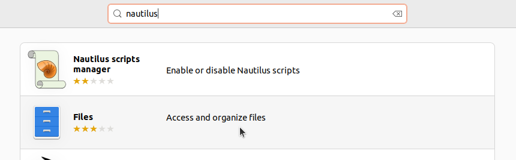
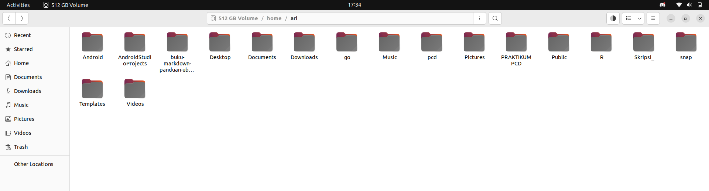

# Instalasi Nautilus
Nautilus atau yang dikenal juga sebagai GNOME Files adalah manajer berkas (file manager) default untuk lingkungan desktop GNOME termasuk Ubuntu. Aplikasi ini memungkinkan pengguna menjelajahi, mengelola, dan memanipulasi file serta folder melalui antarmuka grafis. Nautilus mendukung berbagai fitur seperti pencarian file, pratinjau dokumen, akses jaringan, serta integrasi dengan aplikasi lain melalui ekstensi. Karena kesederhanaannya, Nautilus sangat cocok digunakan dalam lingkungan pendidikan, pengembangan, dan penggunaan sehari-hari.
Secara bawaan ubuntu desktop telah terpasang Nautilus. Namun jika belum terpasang dapat mengikut langkah-langkah berikut.
## Langkah-Langkah Instalasi
### 1. Buka Ubuntu Software
Untuk membuka ubuntu software dapat mengklik icon ubuntu software pada menu applications.

### 2. Cari Nautilus
Klik icon search pada pojok kiri atas ubuntu software kemudian masukkan keyword "Nautilus".

### 3. Install Nautilus
Pilih software yang sesuai kemudian tekan tombol install.

### 4. Verifikasi Instalasi
Tunggu hingga proses instalasi selesai, Nautilus yang sudah terinstall dapat ditemukan pada menu Applications.
Berikut adalah Nautilus ketika berjalan di Ubuntu 22.04 LTS.

