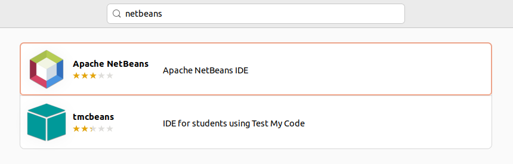
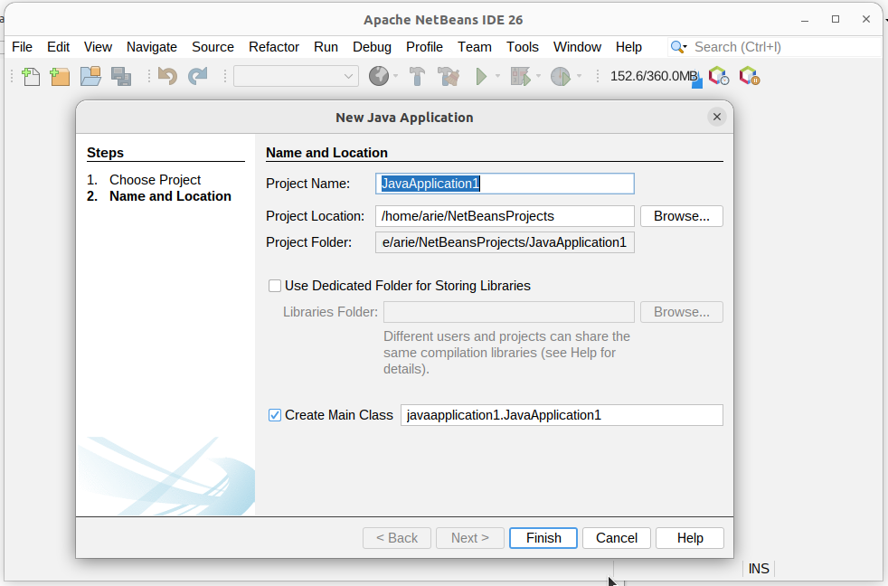

# Instalasi NetBeans
NetBeans adalah lingkungan pengembangan terintegrasi (IDE) sumber terbuka yang digunakan untuk menulis, mengedit, dan menjalankan program dalam berbagai bahasa pemrograman seperti Java, PHP, HTML, C/C++, dan lainnya. NetBeans menyediakan fitur seperti editor cerdas, debugger, integrasi dengan sistem kontrol versi (seperti Git), serta dukungan proyek berbasis Maven dan Gradle, menjadikannya salah satu IDE yang cocok untuk pengembangan aplikasi desktop, web, dan mobile.
## Langkah-Langkah Instalasi
### 1. Buka Ubuntu Software
Untuk membuka ubuntu software dapat mengklik icon ubuntu software pada menu applications.

### 2. Cari NetBeans
Klik icon search pada pojok kiri atas ubuntu software kemudian masukkan keyword "NetBeans".

### 3. Install NetBeans
Pilih software yang sesuai kemudian tekan tombol install.

### 4. Verifikasi Instalasi
Tunggu hingga proses instalasi selesai, NetBeans yang sudah terinstall dapat ditemukan pada menu Applications.
Berikut adalah NetBeans ketika berjalan di Ubuntu 22.04 LTS.

