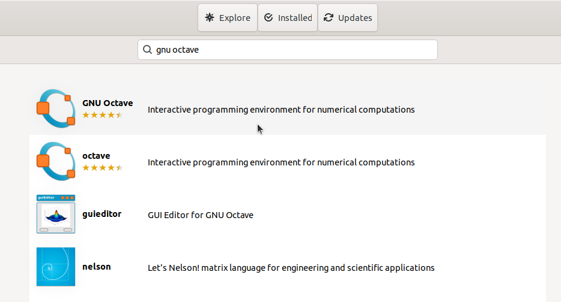
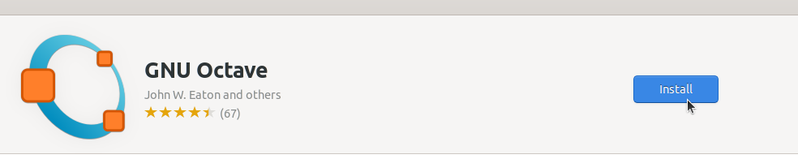
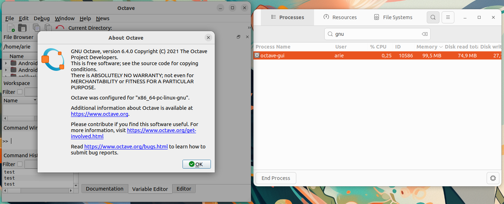

# Instalasi GNU Octave
GNU Octave adalah perangkat lunak open source yang digunakan untuk komputasi numerik, sering dianggap sebagai alternatif dari MATLAB. Octave menyediakan lingkungan berbasis­ bahasa pemrograman tingkat tinggi yang mendukung operasi matriks, pemrosesan data, visualisasi grafis, serta berbagai fungsi matematika dan statistik.

## Langkah-Langkah Instalasi
###    1. Buka Ubuntu Software
Untuk membuka ubuntu software dapat mengklik icon ubuntu software pada menu applications.

###    2. Cari GNU Octave
Klik icon search pada pojok kiri atas ubuntu software kemudian masukkan keyword "GNU Octave".

###    3. Install GNU Octave
Pilih software yang sesuai kemudian tekan tombol install.

###    4. Verifikasi Instalasi
Tunggu hingga proses instalasi selesai, GNU Octave yang sudah terinstall dapat ditemukan pada menu Applications.
Berikut adalah GNU Octave ketika berjalan di Ubuntu 22.04 LTS.

