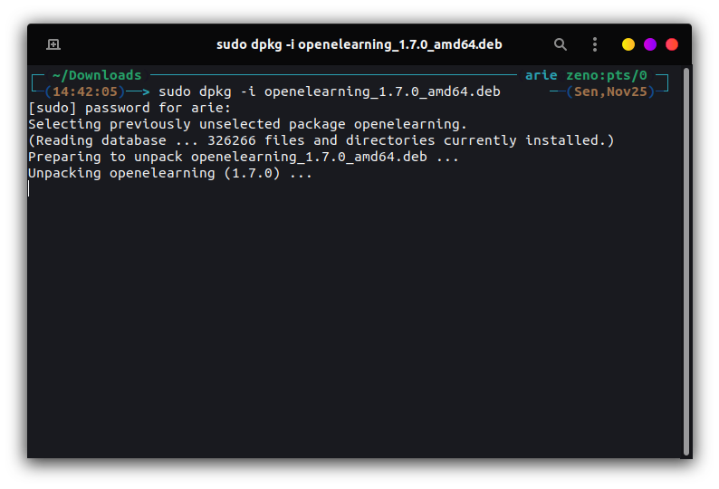
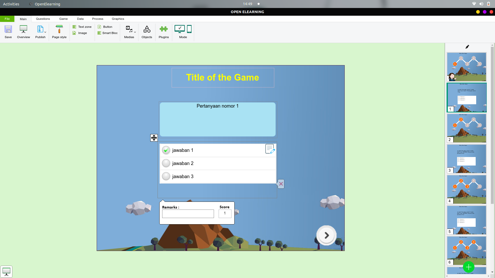

# Instalasi Open Elearning

Unduh paket instalasi pada halaman [Open Elearning](https://www.openelearning.org/download). Kemudian install paket tersebut dengan perintah `dpkg -i namafile.deb`, berikut gambar saat installasi  **Open eLearning** :  

Kemudian berikut adalah gambar dari aplikasi **Open eLearning** setelah terinstal yang digunakan untuk membuat slide presentasi interaktif :

