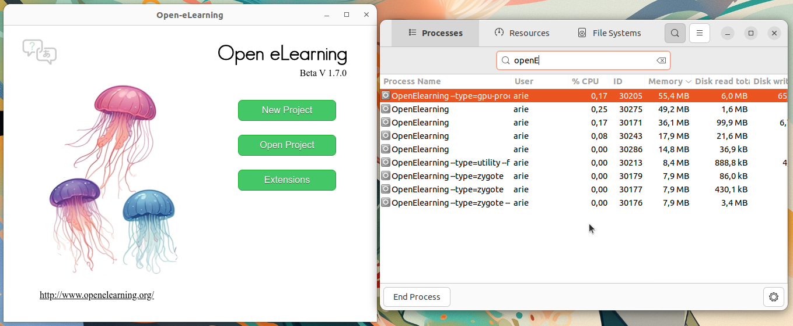

# Instalasi Open eLearning
Open eLearning adalah perangkat lunak open-source yang digunakan untuk membuat materi pembelajaran interaktif. Aplikasi ini memungkinkan pengguna untuk membuat kursus e-learning dengan animasi, kuis, video, dan elemen interaktif lainnya tanpa perlu memiliki keahlian pemrograman.
Software ini sangat cocok bagi pendidik, trainer, dan pengembang konten pembelajaran yang ingin membuat materi edukasi secara efektif.
## Langkah-Langkah Instalasi
### 1. Unduh File Instalasi Open eLearning
Kunjungi https://www.openelearning.org/download kemudian unduh file instalasi untuk sistem operasi Linux.
### 2. Install Open eLearning
Pada terminal masuk ke direktori tempat file instalasi open eLearning disimpan (biasanya terletak pada direktori Downloads), gunakan perintah berikut untuk berpindah direktori: 
```bash
cd Downloads/
```
Berikut adalah output jika telah berpindah direktori:
```bash
arie@zeno:~/Downloads$ 
```

Kemudian gunakan perintah berikut untuk melakukan instalasi open eLearning:
```bash
sudo dpkg -i openelearning_1.7.0_amd64.deb
```
Jika instalasi berhasil output baris terakhirnya akan seperti berikut:
```bash
Preparing to unpack openelearning_1.7.0_amd64.deb ...
Unpacking openelearning (1.7.0) over (1.7.0) ...
Setting up openelearning (1.7.0) ...
Processing triggers for gnome-menus (3.36.0-1ubuntu3) ...
Processing triggers for mailcap (3.70+nmu1ubuntu1) ...
Processing triggers for desktop-file-utils (0.26-1ubuntu3) ...
```
### 3. Verifikasi Instalasi
Open eLearning yang sudah terinstall dapat ditemukan pada menu Applications. 
Berikut adalah Open eLearning ketika berjalan di Ubuntu 22.04 LTS.

