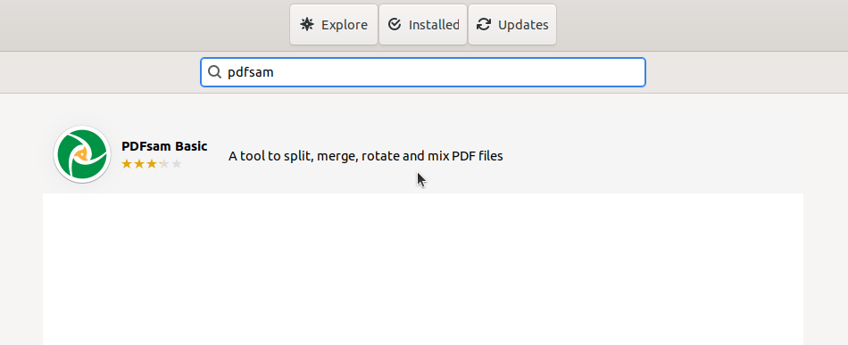
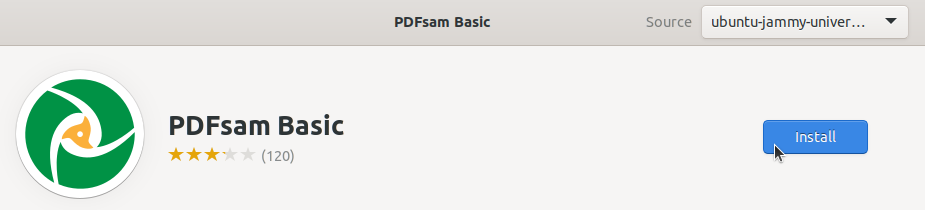
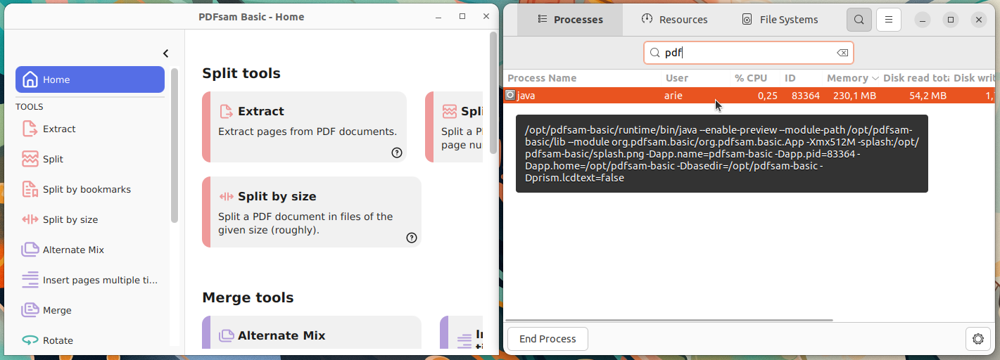

# Instalasi PDFSam Basic
PDFsam adalah aplikasi sumber terbuka yang memungkinkan pengguna untuk membagi, menggabungkan, dan memutar file PDF tanpa biaya. Aplikasi ini berguna dalam dunia pendidikan untuk mengelola materi ajar, tugas kuliah dan dokumen administratif secara efisien. PDFsam berbasis Java sehingga dapat dijalankan di berbagai sistem operasi termasuk Ubuntu Linux.
## Langkah-Langkah Instalasi
### 1. Buka Ubuntu Software
Untuk membuka ubuntu software dapat mengklik icon ubuntu software pada menu applications.

### 2. Cari PDFSam Basic
Klik icon search pada pojok kiri atas ubuntu software kemudian masukkan keyword "PDFSam Basic".

### 3. Install PDFSam Basic
Pilih software yang sesuai kemudian tekan tombol install.

### 4. Verifikasi Instalasi
Tunggu hingga proses instalasi selesai, PDFSam Basic yang sudah terinstall dapat ditemukan pada menu Applications.
Berikut adalah PDFSam Basic ketika berjalan di Ubuntu 22.04 LTS.

