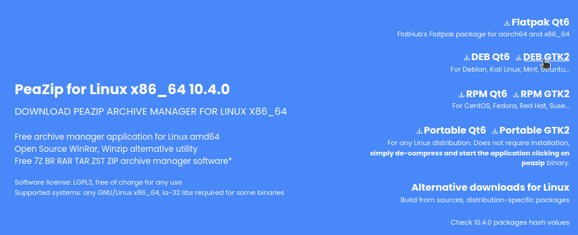
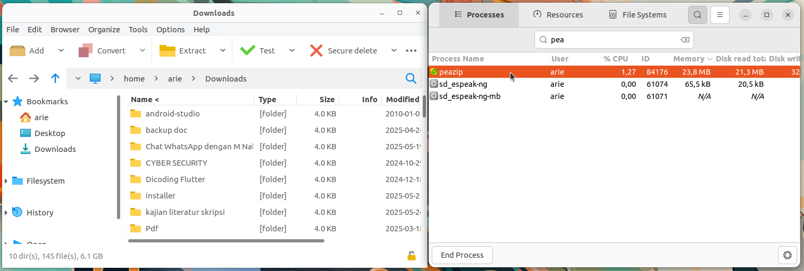

# Instalasi PeaZip
PeaZip adalah perangkat lunak manajemen arsip (archive manager) lintas platform yang mendukung lebih dari 180 format file termasuk ZIP, RAR, TAR, 7Z dan lainnya. PeaZip bersifat open-source dan memiliki antarmuka grafis (GUI) yang intuitif.
## Langkah-Langkah Instalasi
### 1. Unduh File Instalasi PeaZip
Kunjungi https://peazip.github.io/peazip-linux.html  kemudian unduh file instalasi untuk sistem operasi ubuntu.



### 2. Install PeaZip
Pada terminal masuk ke direktori tempat file instalasi visual studio code disimpan (biasanya terletak pada direktori Downloads), gunakan perintah berikut untuk berpindah direktori: 
```bash
cd Downloads/
```
Berikut adalah output jika telah berpindah direktori:
```bash
arie@zeno:~/Downloads$ 
```
Kemudian gunakan perintah berikut untuk melakukan instalasi PeaZip:
```bash
sudo dpkg -i peazip_10.3.0.LINUX.GTK2-1_amd64.deb
```
Jika instalasi berhasil outputnya akan seperti berikut:
```bash
Selecting previously unselected package peazip.
(Reading database ... 356979 files and directories currently installed.)
Preparing to unpack peazip_10.3.0.LINUX.GTK2-1_amd64.deb ...
Unpacking peazip (10.3.0) ...
Setting up peazip (10.3.0) ...
```
### 3. Verifikasi Instalasi
PeaZip yang sudah terinstall dapat ditemukan pada menu Applications. 
PeaZip yang sudah terinstall juga dapat dijalankan dengan perintah berikut pada terminal:
```bash
peazip 
```
Kemudian jendela PeaZip akan muncul.
Berikut adalah PeaZip ketika berjalan pada Ubuntu 22.04 LTS.



