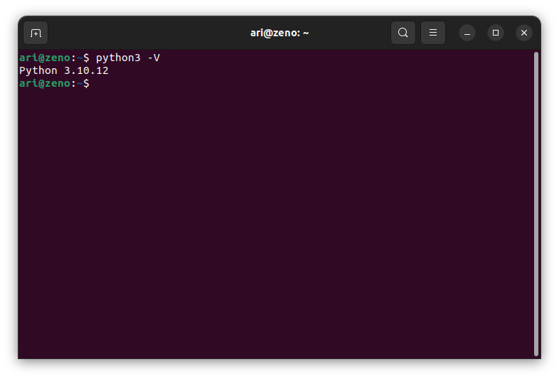

# Instalasi Pip Python
Untuk memasang **Pip Python** pastikan **Python** sudah terpasang sebelumnya, gunakan perintah `python3 -V` untuk memastikan python sudah terpasang.

 

Pada terminal masukkan perintah `sudo apt install python3-pip` untuk memasang **pip python**. Kemudian gunakan perintah `pip -V` untuk memeriksa versi pip yang sudah terpasang.

 

