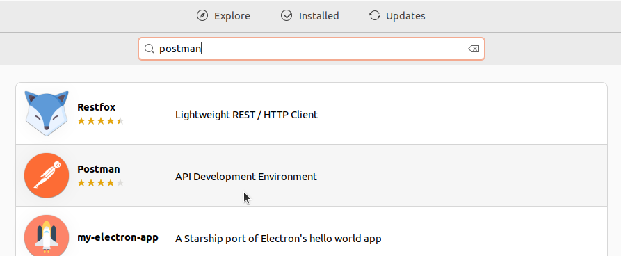
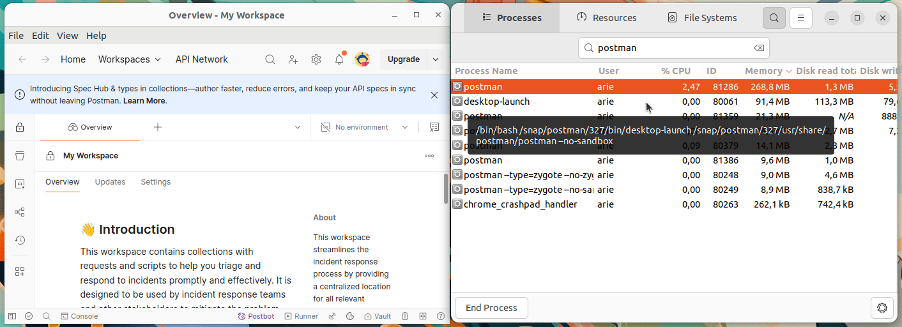

# Instalasi Postman
Postman adalah aplikasi API client yang digunakan untuk mengembangkan, menguji, dan mendokumentasikan Application Programming Interface (API). Postman mendukung berbagai metode HTTP (GET, POST, PUT, DELETE, dll.) dan dilengkapi fitur seperti koleksi, environment, test scripting, serta integrasi dengan CI/CD. Postman banyak digunakan oleh pengembang backend, frontend, dan QA untuk keperluan debugging serta otomasi pengujian API.
## Langkah-Langkah Instalasi
### 1. Buka Ubuntu Software
Untuk membuka ubuntu software dapat mengklik icon ubuntu software pada menu applications.

### 2. Cari Postman
Klik icon search pada pojok kiri atas ubuntu software kemudian masukkan keyword "Postman".

### 3. Install Postman
Pilih software yang sesuai kemudian tekan tombol install.

### 4. Verifikasi Instalasi
Tunggu hingga proses instalasi selesai, Postman yang sudah terinstall dapat ditemukan pada menu Applications.
Berikut adalah Postman ketika berjalan di Ubuntu 22.04 LTS.

