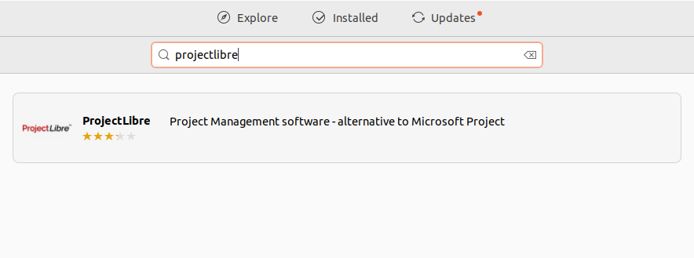
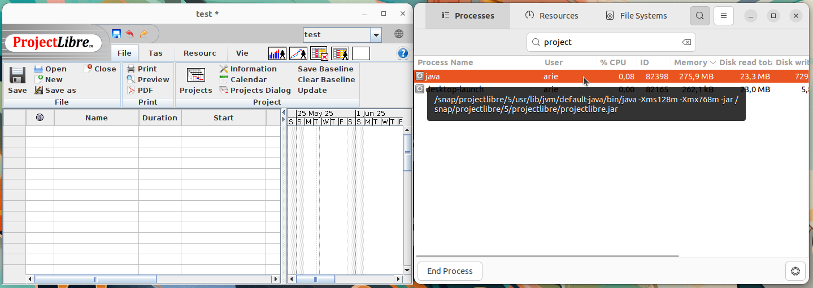

# Instalasi ProjectLibre
ProjectLibre adalah perangkat lunak manajemen proyek open-source yang dirancang sebagai alternatif dari Microsoft Project. Aplikasi ini memungkinkan pengguna untuk merencanakan proyek, membuat jadwal, menetapkan tugas, mengelola sumber daya, serta memantau kemajuan proyek secara visual menggunakan Gantt Chart dan tampilan lainnya. ProjectLibre sangat cocok digunakan oleh mahasiswa, manajer proyek, dan tim pengembangan dalam mengelola proyek berskala kecil hingga menengah.
## Langkah-Langkah Instalasi
### 1. Buka Ubuntu Software
Untuk membuka ubuntu software dapat mengklik icon ubuntu software pada menu applications.

### 2. Cari ProjectLibre
Klik icon search pada pojok kiri atas ubuntu software kemudian masukkan keyword "ProjectLibre".

### 3. Install ProjectLibre
Pilih software yang sesuai kemudian tekan tombol install.

### 4. Verifikasi Instalasi
Tunggu hingga proses instalasi selesai, ProjectLibre yang sudah terinstall dapat ditemukan pada menu Applications.
Berikut adalah ProjectLibre ketika berjalan di Ubuntu 22.04 LTS.

