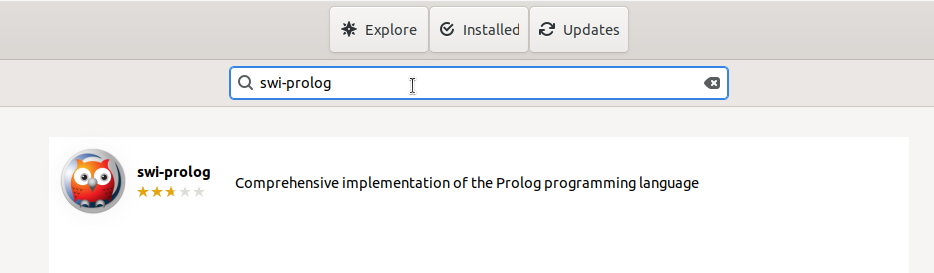
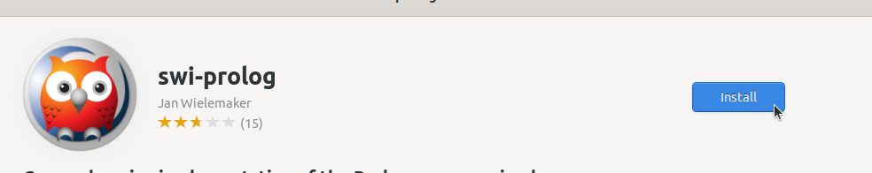
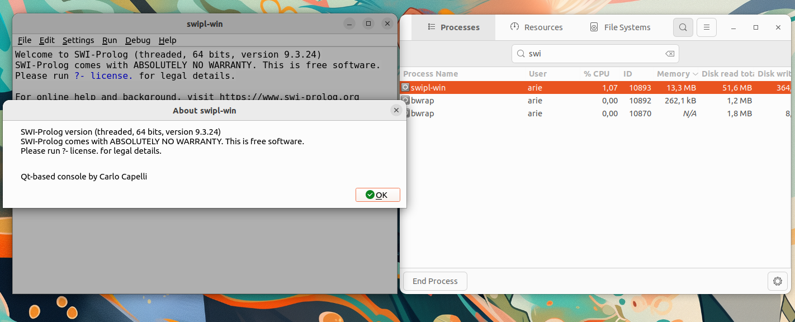

# Instalasi SWI-Prolog
SWI-Prolog adalah implementasi bahasa pemrograman Prolog yang populer, dikembangkan oleh Jan Wielemaker dan komunitasnya. Prolog sendiri adalah bahasa pemrograman berbasis logika yang banyak digunakan dalam kecerdasan buatan (AI), sistem pakar, pemrosesan bahasa alami (NLP), serta pengembangan basis data berbasis aturan.
## Langkah-Langkah Instalasi
### 1. Buka Ubuntu Software
Untuk membuka ubuntu software dapat mengklik icon ubuntu software pada menu applications.

### 2. Cari SWI-Prolog
Klik icon search pada pojok kiri atas ubuntu software kemudian masukkan keyword "SWI-Prolog".

### 3. Install SWI-Prolog
Pilih software yang sesuai kemudian tekan tombol install.

### 4. Verifikasi Instalasi
Tunggu hingga proses instalasi selesai, SWI-Prolog yang sudah terinstall dapat ditemukan pada menu Applications.
Berikut adalah SWI-Prolog ketika berjalan di Ubuntu 22.04 LTS.

