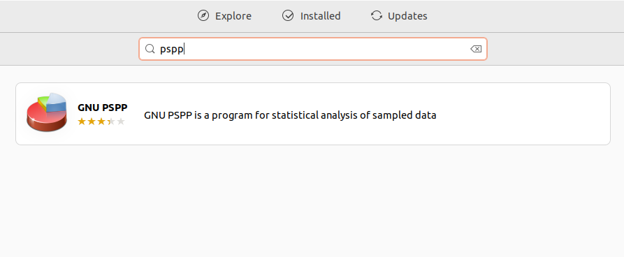
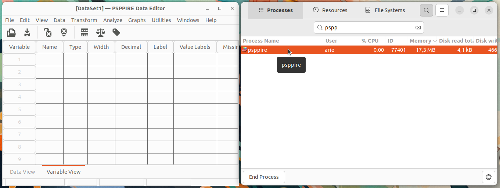

# Instalasi PSPP
PSPP adalah perangkat lunak statistik bebas dan sumber terbuka yang digunakan untuk analisis statistik data kuantitatif. PSPP dirancang sebagai alternatif dari IBM SPSS, dan mendukung berbagai teknik analisis statistik seperti uji t, ANOVA, regresi linear, dan analisis non-parametrik. Dengan antarmuka grafis yang intuitif, PSPP sangat cocok digunakan dalam lingkungan akademik untuk kebutuhan penelitian dan analisis data.
## Langkah-Langkah Instalasi
### 1. Buka Ubuntu Software
Untuk membuka ubuntu software dapat mengklik icon ubuntu software pada menu applications.

### 2. Cari PSPP
Klik icon search pada pojok kiri atas ubuntu software kemudian masukkan keyword "PSPP".

### 3. Install PSPP
Pilih software yang sesuai kemudian tekan tombol install.

### 4. Verifikasi Instalasi
Tunggu hingga proses instalasi selesai, PSPP yang sudah terinstall dapat ditemukan pada menu Applications.
Berikut adalah PSPP ketika berjalan di Ubuntu 22.04 LTS.

