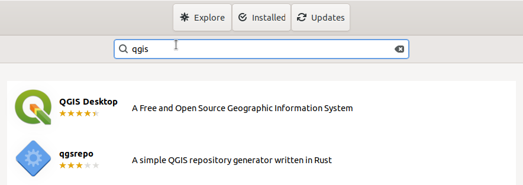
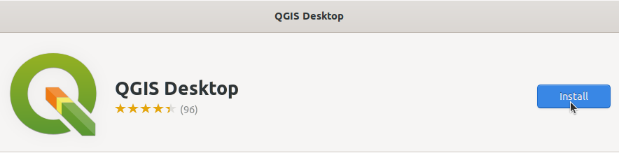

# Instalasi QGIS
QGIS adalah perangkat lunak open-source yang digunakan untuk pendidikan matematika, baik di tingkat sekolah maupun Universitas. QGIS menyediakan berbagai alat untuk geometri, aljabar, kalkulus, statistik, dan banyak lagi, yang memungkinkan pengguna untuk mengeksplorasi konsep matematika secara interaktif. QGIS digunakan oleh guru, siswa, dan peneliti untuk memvisualisasikan dan menganalisis objek matematis dalam berbagai bentuk, seperti grafik fungsi, geometri dinamis, dan data statistik.
## Langkah-Langkah Instalasi
### 1. Buka Ubuntu Software
Untuk membuka ubuntu software dapat mengklik icon ubuntu software pada menu applications.

### 2. Cari QGIS
Klik icon search pada pojok kiri atas ubuntu software kemudian masukkan keyword "QGIS".

### 3. Install QGIS
Pilih software yang sesuai kemudian tekan tombol install.

### 4. Verifikasi Instalasi
Tunggu hingga proses instalasi selesai, QGIS yang sudah terinstall dapat ditemukan pada menu Applications.
Berikut adalah QGIS ketika berjalan di Ubuntu 22.04 LTS.

