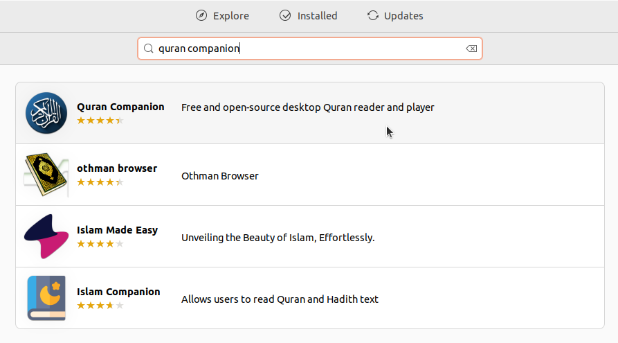
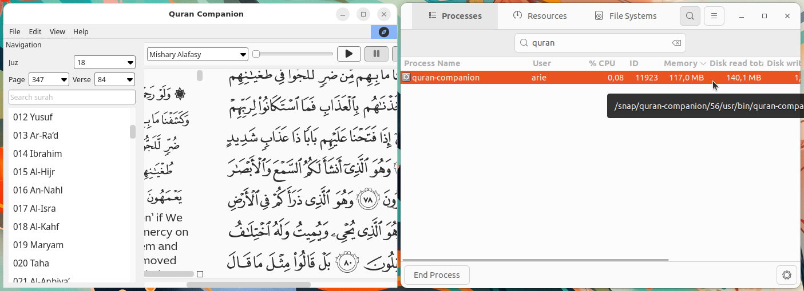

# Instalasi Quran Companion
Quran Companion adalah perangkat lunak open source yang digunakan untuk membaca dan mendengarkan Al-Qur'an.## Langkah-Langkah Instalasi
### 1. Buka Ubuntu Software
Untuk membuka ubuntu software dapat mengklik icon ubuntu software pada menu applications.

### 2. Cari Quran Companion
Klik icon search pada pojok kiri atas ubuntu software kemudian masukkan keyword "Quran Companion".

### 3. Install Quran Companion
Pilih software yang sesuai kemudian tekan tombol install.

### 4. Verifikasi Instalasi
Tunggu hingga proses instalasi selesai, Quran Companion yang sudah terinstall dapat ditemukan pada menu Applications.
Berikut adalah Quran Companion ketika berjalan di Ubuntu 22.04 LTS.

