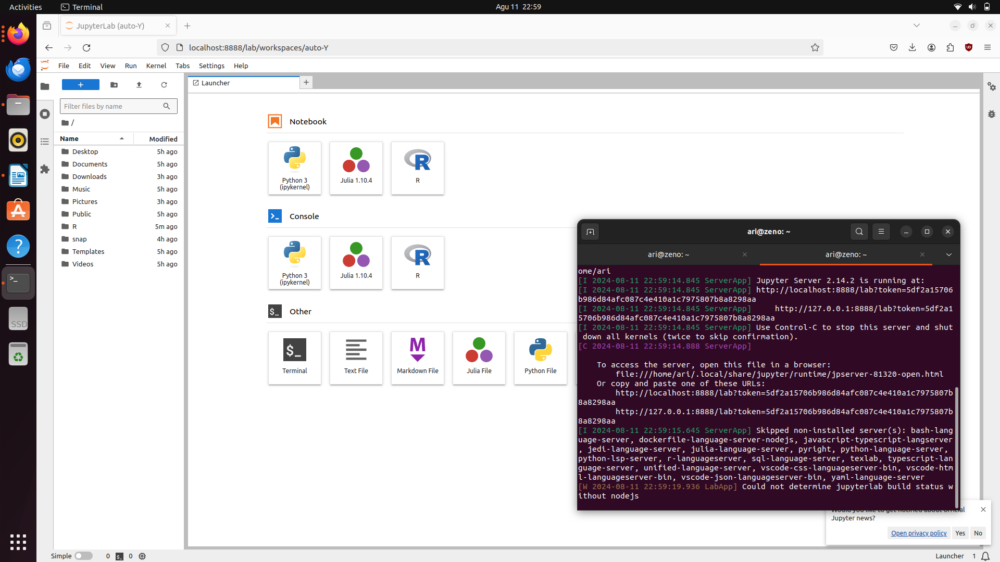

# Instalasi R dan Menambahkan Kernel R
Untuk menambahkan **R** kedalam **jupyterLab** pastikan sudah menginstall **R** terlebih dahulu, jika belum install **R** dengan perintah `sudo apt install r-base-core`. Setelah terinstall masuk ke session **R** dengan perintah `R` kemudian install paket yang diperlukan dengan perintah `install.packages(c('repr', 'IRdisplay', 'IRkernel'), type = 'source')` dan `Irkernel::installspec()`. 

 

