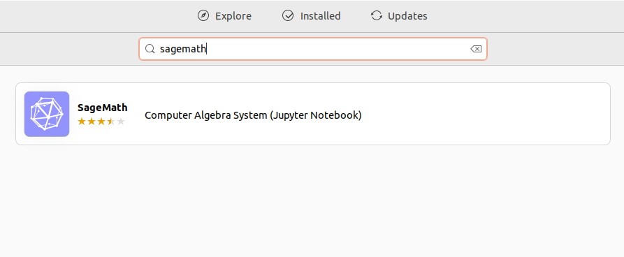
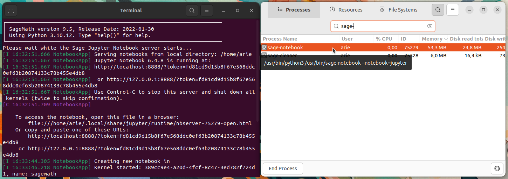

# Instalasi Sagemath
SagSageMath adalah perangkat lunak open-source untuk komputasi matematika yang mencakup aljabar, kalkulus, teori bilangan, statistik, kriptografi, dan lainnya. SageMath mengintegrasikan berbagai pustaka matematika populer seperti NumPy, SciPy, Matplotlib, SymPy, Maxima, dan banyak lagi, dalam satu antarmuka terpadu berbasis Python.
## Langkah-Langkah Instalasi
### 1. Buka Ubuntu Software
Untuk membuka ubuntu software dapat mengklik icon ubuntu software pada menu applications.

### 2. Cari Sagemath
Klik icon search pada pojok kiri atas ubuntu software kemudian masukkan keyword "Sagemath".

### 3. Install Sagemath
Pilih software yang sesuai kemudian tekan tombol install.

### 4. Verifikasi Instalasi
Tunggu hingga proses instalasi selesai, Sagemath yang sudah terinstall dapat ditemukan pada menu Applications.
Berikut adalah Sagemath ketika berjalan di Ubuntu 22.04 LTS.

