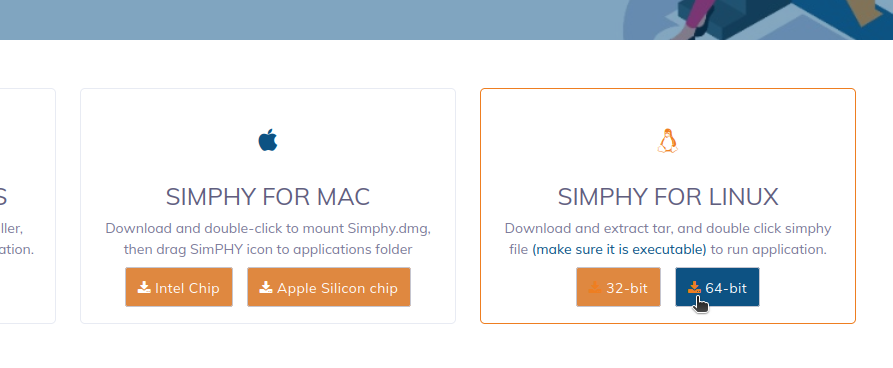
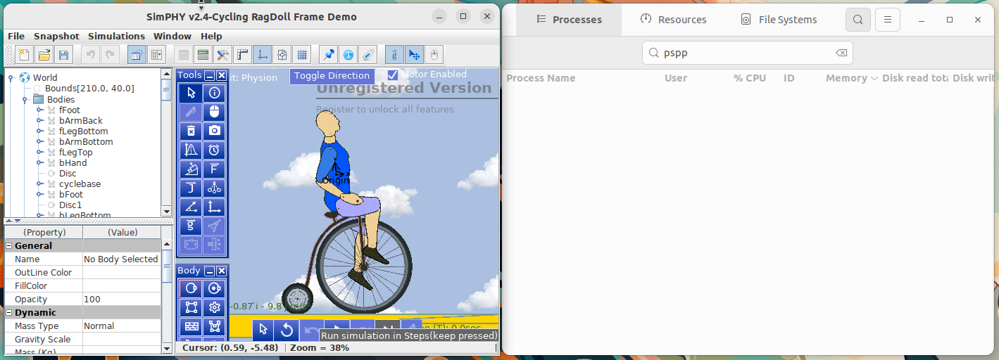

# Instalasi SimPHY
simPHY adalah aplikasi simulasi interaktif berbasis Java yang digunakan untuk membantu pembelajaran fisika secara visual. Aplikasi ini menyediakan berbagai eksperimen fisika dalam bentuk simulasi yang dapat dimanipulasi pengguna, seperti hukum Newton, gerak proyektil, medan listrik, dan lainnya. Dengan tampilan yang intuitif dan pendekatan berbasis eksperimen, simPHY sangat bermanfaat bagi siswa dan mahasiswa dalam memahami konsep-konsep fisika secara praktis.
## Langkah-Langkah Instalasi
### 1. Unduh File Instalasi SimPHY
Kunjungi https://simphy.com/downloads kemudian unduh file instalasi untuk sistem operasi Linux.



### 2. Ekstrak File ZIP SimPHY
Karena file instalasi SimPHY berekstensi ZIP, maka perlu di ekstrak terlebih dahulu. Pada terminal masuk ke direktori tempat file instalasi SimPHY disimpan (biasanya terletak pada direktori Downloads), gunakan perintah berikut untuk berpindah direktori: 
```bash
cd Downloads/
```
Berikut adalah output jika telah berpindah direktori:
```bash
arie@zeno:~/Downloads$ 
```
Kemudian gunakan perintah berikut untuk melakukan ekstraksi file ZIP:
```bash
unzip SimPHY-2.0-linux64.zip -d ~/.local/share/
```
Jika unzip berhasil akan ada output seperti berikut pada baris terakhir.
```bash
iinflating: /home/arie/.local/share/SimPHY-1.6-linux64/simphy.jar  
inflating: /home/arie/.local/share/SimPHY-1.6-linux64/exp4j-0.4.8.jar  
inflating: /home/arie/.local/share/SimPHY-1.6-linux64/Logging.html  
inflating: /home/arie/.local/share/__MACOSX/SimPHY-1.6-linux64/._Logging.html  
inflating: /home/arie/.local/share/__MACOSX/._SimPHY-1.6-linux64
```
### 3. Buat Shortcut Menu
Agar lebih praktis SimPHY dapat ditambahkan ke menu aplikasi sehingga untuk mengaksesnya dapat langsung mengklik ikon Winbox pada menu aplikasi. Gunakan perintah berikut untuk membuat file simphy.desktop sekaligus mengedit isi filenya:
```bash
nano ~/.local/share/applications/simphy.desktop 
Kemudian isi dengan script berikut:
[Desktop Entry]
Name=SimPHY
Exec=/home/arie/.local/share/SimPHY-1.6-linux64/simphy
Icon=application
Type=Application
Categories=Network; 
```
### 4. Verifikasi Instalasi
SimPHY yang sudah terinstall dapat ditemukan pada menu Applications.
Berikut adalah SimPHY ketika berjalan di Ubuntu 22.04 LTS.


