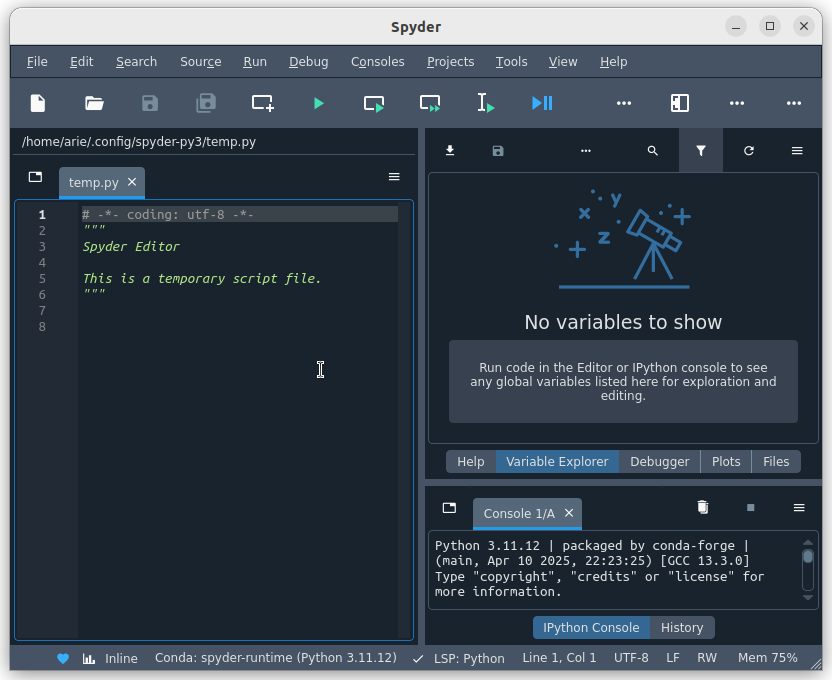

# Instalasi Spyder
Spyder adalah IDE (Integrated Development Environment) open-source yang dirancang khusus untuk analisis data, scientific computing, dan pemrograman Python. Spyder dilengkapi dengan editor kode interaktif, console IPython, penampil variabel (Variable Explorer), debugger, serta integrasi dengan pustaka seperti NumPy, SciPy, Matplotlib, Pandas, dan lainnya. Karena fitur-fitur tersebut, Spyder sangat populer di kalangan ilmuwan data, peneliti, dan mahasiswa dalam bidang komputasi ilmiah.
## Langkah-Langkah Instalasi
### 1. Unduh File Instalasi Spyder
Kunjungi https://www.spyder-ide.org/download kemudian unduh file instalasi untuk sistem operasi Linux.

### 2. Install Spyder
Pada terminal masuk ke direktori tempat file instalasi open eLearning disimpan (biasanya terletak pada direktori Downloads), gunakan perintah berikut untuk berpindah direktori: 
```bash
cd Downloads/
```
Berikut adalah output jika telah berpindah direktori:
```bash
arie@zeno:~/Downloads$ 
```
Kemudian gunakan perintah berikut untuk memberi izin eksekusi file:
```bash
chmod +x Spyder-Linux-x86_64.sh
```
Kemudian jalankan file tersebut dengan perintah berikut:
```bash
./Spyder-Linux-x86_64.sh
```
Kemudian wizard instalasi Spyder akan muncul pada terminal.
Jika instalasi berhasil maka output baris terakhirnya seperti berikut :
```bash
installation finished.
Thank you for installing Spyder!
```
### 3. Verifikasi Instalasi
Spyder yang sudah terinstall dapat ditemukan pada menu Applications. 
Berikut adalah Spyder ketika berjalan di Ubuntu 22.04 LTS.


